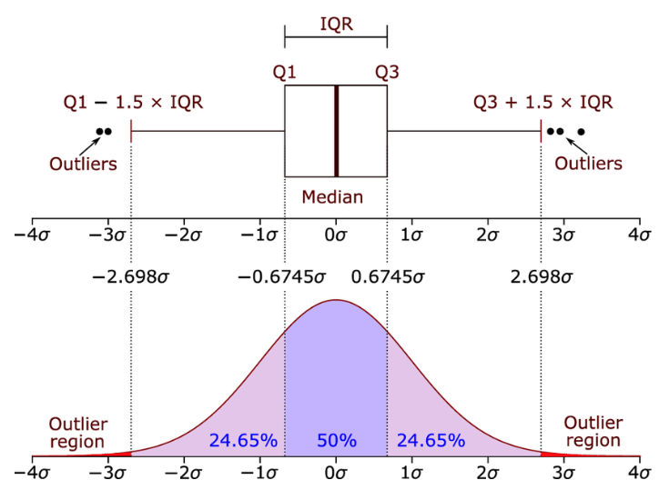
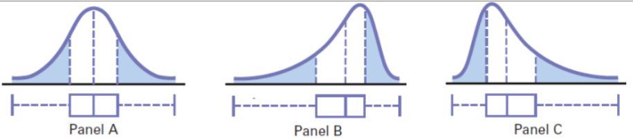
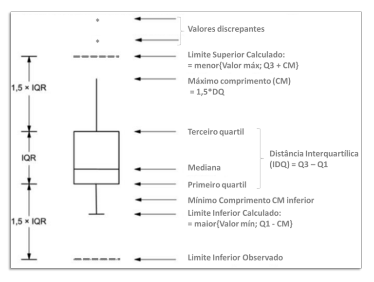
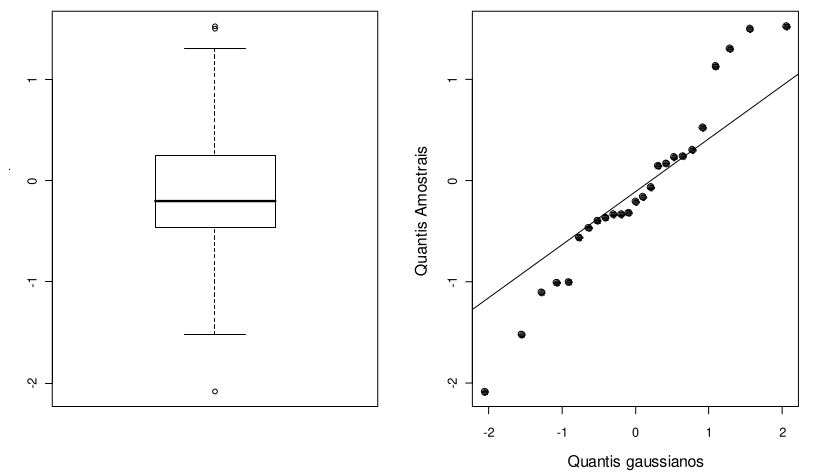
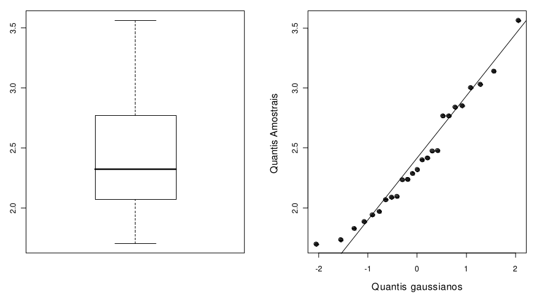
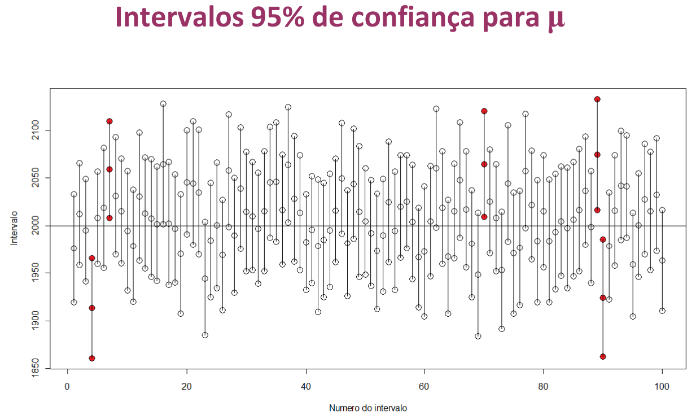

## Análise de Dados

Neste capítulo será introduzido o conceito de análise exploratória de dados, área esta que vem recebendo maior atenção dos intitulados "**cientista de dados**", já citado por J. W. Tukey em 1962, quanto então este papel era executado habilmente pelo estatísticos, através dos estudos de **inferência estatística**, ou seja, execução de procedimentos e técnicas estatísticas sobre **amostras** na tentativa de extrair informações importantes e úteis sobre grandes **populações**.

O grande desafio do "Cientista de dados" é depurar os dados brutos para obter dados utilizáveis, ojetivos, para o estudo que pretende conduzir. A coleta de dados é uma etapa crítica, e deve estar alinhada para com o propósito esperado e entregas finais do projeto que se conduza. Não raramente muitos projetos são abortados por se negligenciar uma correta preparação dos dados, dificultando uma análise objetiva, demandando extensos trabalhos de nova coleta ou, até mesmo, uma reorganização dos dados em suas classes e formatações, para que se permita uma análise correta estatisticamente.

Mas como se classificam estes dados?

Em geral os dados odem ser classificados nas seguintes classes gerais:

-   Numéricos (quantitativos)

    -   *Contínuos*: são caracterizados por serem um conjunto de números reais (também não inteiros);

        -   Tempo, peso, distância, altura, etc.

    -   *Discretos*: são caracterizados por assumirem valores típicos de contagem, enumeráveis.

        -   Número de filhos, gols em um jogo, número de acertos em uma aposta, idade (anos completos), etc.

-   Categóricos (qualitativos).

```         
-   *Ordinais*: são caracterizados por apresentarem uma ordenação lógica, sequencial natural;      -   Escolaridade, níveis de qualidade (ruim, boa, excelente), escala de satisfação (0 a 5, por exemplo), etc.  -   *Nominais*: são caracterizados por **NÃO** apresentar uma ordenação natural, identificando características fundamentais para os valores amostrados ou populacionais.      -   Sexo, cor do cabelo, raça, classe, etc.
```

Associamos às classes acima a denominação de **variáveis** quando estamos interessados em atuar sobre elas em projetos, em ações de alteração de níveis de resposta, seja na rotina do trabalho, na pesquisa, enfim, em busca de otimizações de desempenho. Mais especificamente podemos denominá-las como sendo **variáveis-resposta** ou variáveis **dependentes** (Y). Sendo estas variáveis que possa controlar ou agir, verificar e alterar as condições do processo, denominamos estas variáveis como sendo **variáveis de controle** (afetam ou determinam uma característica final do produto) ou **de verificação** (atuam na trasnformação do produto no processo e futuramente entregarão a(s) especificação(ões) desejadas pelo cliente).

No início deste livro foi citado a importância de se trabalhar com os dados normais, ou seja, que sigam a distribuição de probabilidades de Gauss. Nem sempre teremos essa condição satisfeita e outras distribuições de probabilidades estarão presentes no processo, como a distribuição de Poison, por exemplo, muito comum nos processos logísticos, por exemplo.

É muito importante testar os dados antes de iniciarmos análises estatísticas que dependam da condição de normalidade dos dados, evitando assim erros grosseiros nas análises. Há testes estatísticos e também análises gráficas que ajudam o profissional a identificar facilmente o atendimento a esta condição. O leitor deve se lembrar que uma estatística é conduzida a partir de amostragensobre uma parte de uma população, e com estes ados obtidos busca-se inferir com certo grau de confiança sobre estes valores na população.

**"Uma distribuição de probabilidades é um modelo matemático que associa um determinado valor de uma variável com a probabilidade de ocorrência desse valor na população** (*Montgomery*).

Assim, devemos treinar nossa capacidade de enxergar o **"mundo probabilístico"** ao lado do **"mundo determinístico"**. Muitos processos são perfeitamente explicáveis segundo modelos estatísticos adequados, e, em alguns casos, os únicos possíveis de execução por modelamento, dada a complexidade, custo, porte ou simplesmente tempo para análises determinísticas.

Os modelos diversos podem ser aplicados sobre variáveis discretas ou em variáveis contínuas. Quando aplicadas sobre variáveis discretas, terão como base os mopdelos discretos de distribuição de probabilidades, como nos casos onde deseja-se avaliar o número de não-confrmidades ou defeitos em produtos. Já quando aplicados sobre variáveis contínuas, os modelos probabilísticos de distribuições contínuas terão o seu lugar, como nos casos onde modelamentos de variáveis contínuas como tempo, comprimento, distância, peso, etc.

Uma distribuição contínua pode ser modelada segundo a área sob uma curva de suavização expressa por uma integral em um intervalo definido, como:

$$ P (a \leq x \leq b) = \int_b^af(x)dx $$

As principais distribuições que serão abordadas neste capítulo são de variáveis contínuas, e oportunamente serão apresentados as demais. As distribuições contínuas de foco neste momento são:

-   Distribuição Normal (Gaussiana)

-   Distribuição t de Student

-   Distribuição F

-   Distribuição Qui-quadrado

Vamos abordar cada uma delas agora.

### Distribuição Normal

A distribuição mais amplamente utilizada é a distribuição normal de Gauss (gaussiana). Dado o Teorema do Limite Central, que estabelece que à medida que haja a realização de um experimento aleatório que gere dados aleatórios de uma variável, e que, aumentando o número de réplicas desse experimento e aumentando assim o número de amostras obtidas, a esperança de que um valor médio surja naturalmente como tempo, dado que será o valor médio dos pontos amostrados, gerando um curva simétrica com média igual à média populacional ($\mu$) e desvio padrão populacional conhecido ($\sigma²$). Representamos assim a distribuição normal por N($\mu$, $\sigma²$).

A melhor forma de visualizar a distribuição normal é a construção de curvas gaussianas a partir de valores de N($\mu$, $\sigma²$) conhecidos. Vamos rever os principais conceitos gráficos com os scripts em R a seguir.

A densidade de uma variável aleatória normal X, com média $\mu$ e variãncia $\sigma²$ é dada por:

$$ f(x;\mu,\sigma^2) = \frac{1}{\sigma\sqrt{2\pi}} e^{ -\frac{1}{2}\left(\frac{x-\mu}{\sigma}\right)^2 } $$

A variância populacional para (-$\infty$ $\leq$ *x* $\leq$ $\infty$) é dada por:

$$\sigma² = \frac{\sum\limits_{i=1}^{N} (x_i- \mu)²}{N}$$

O Desvio-padrão populacional é dado por:

$$\sigma = \sqrt\frac{\sum\limits_{i=1}^{N} (x_i- \mu)²}{N}$$

A curva resultante tem a forma de sino e é perfeitamente simétrica quando a média se iguala à mediana dos dados, e apresentará assimetria para casos quando são distintas, ou à esquerda ou à direita. Como vimos anteriormente, a precisão de um instrumento de medição está diretamente associada ao desvio-padrão dos dados coletados por ele, sendo que maiores valores do desvio-padrão indicam menor precisão do equipamento. O gráfico a seguir demonstra que uma mesma média de duas amostras diferentes podem apresentar diferentes curvas gaussianas por possuírem diferentes valores do desvio-padrão. Isso tem grandes implicações para caracterização d eprocessos pois maiores desvo-padrões geram maiores áreas fora dos limites de controle e com isso, maiores perdas associadas ao processo.

#### Elaborando curvas normais com R

Nas análises estatísticas de dados normais, é comum gerar os histogramas para os dados e se determinar a área relativa abaixo da curva para um dado valor Z conhecido (vide curva normal padrão). Para tanto, basta conhecer o valor Z (Score Z) ou o valor da grandeza em análise e transformá-la no Score Z correspondente pela equação:

$$ Z = \dfrac{ \bar{x} - \mu}{s} $$

onde:

$$ \bar{x} : é \ o \ valor \ médio \ amostral \ da \ variável\ de \ interesse. $$ \$\$\mu : é  a  média  populacional

\$\$

\$\$  s: é  o  desvio-padrão amostral. \$\$

Vejamos como gerar alguns tipos de curvas normais a seguir.

#### Área superior

Imagine que vocẽ queira gerar uma curva normal representativa de um deslocamento de um veículo que tenha média de velocidade igual a 60 Km/h e desvio-padrão de 20 km/h. Deseja-se marcar no histograma a área relativa às velocidades superiores a duas vezes o desvio-padrão, ou seja, 2 x 20 = 40 km/h acima da média de velocidade. Assim, deve ser marcada a área acima de 100km/h.

Há duas maneiras de se fazer isso:

-   gerar os dados de forma aleatória (o que aqui foi feito).

-   Coletar daddos reais e plotar.

Para gerar os dados aleatórios, faz-se os seguintes passos:

-   Criar uma sequência de pontos aleatórios em "steps" definidos, ou seja, a grandeza de diferenciação dos valores aleatórios. Armazenar em um vetor.

-   Criar a distribuição normal da variável criada no passo anterior, definindo uma média e um desvio-padrão. Armazenar em um vetor.

-   Definir uma área de interesse para hachurar e gerar coordenadas em X e em Y para delimitar a área a hachurar.

-   Plotar a curva e o polígono definido anteriormente.

-   Adicionar informações e linhas de interesse no histograma, como média, e outras formatações etéticas no gráfico.

Segue um exemplo ilustrativo:

```{r, c1079}
x<-seq(-30, 150, by =.01) 
y<-dnorm(x, mean=60, sd=20, log = FALSE) 
rx<-seq(100, 150, by =.1) 
ry<-numeric(2*length(rx)) 
ry[1:length(rx)]<-dnorm(rx, mean=60, sd=20, log=FALSE) 
rx<-c(rx, rev(rx)) 
plot(x, y, 'l', xlab='Velocidade (km/h)', ylab='fdp(x)', main="Distribuição Normal - Velocidade") 
polygon(rx, ry, col = "gray") 
abline(v=60, h=0, lty=3)

```

#### Área intermediária

Neste exemplo, deseja-se hachurar a área compreendida entre os quartis Q1 e Q3, para o exemplo anterior. Assim, sabendo que os quartis são inicialmente desconhecidos, devemos encontrálos através de comandos tipo "qnorm" no R. Os quantis seriam aqueles percentis que separam os 25% menores valores e os 75% maiores valores, estando entre eles 50% dos dados. Assim:

```{r, c1096}
Q1<- qnorm(0.25, mean=60, sd=20)  
Q1  
Q3<- qnorm(0.75, mean=60, sd=20) 
Q3
```

```{r, c1104}
x<-seq(-30, 150, by = .01) 
y<-dnorm(x, mean=60, sd=20, log = FALSE)  
rx<-seq(Q1, Q3, by=.1) 
ry<-numeric(2*length(rx)) 
ry[1:length(rx)]<-dnorm(rx, mean=60, sd=20, log = FALSE) 
rx<-c(rx, rev(rx)) 
plot(x, y, 'l', xlab='Velocidade (Km/h)', ylab='fdp(x)',      main = "Distribuição Normal - Velocidade") 
polygon(rx, ry, col = 'blue') 
abline(v=60, h=0, lty=3)
```

#### Alternativa - sem escala Z

Hachurar a área superior onde se encontra o percentil sobre o qual está abaixo dele 99,73% dos dados.

Assim:

```{r, c1124}
p3sigma<- qnorm(0.9973, mean=0, sd=1) 
p3sigma
```

```{r, c1129}
x<-seq(-4, 4, by =.01) 
y<-dnorm(x, mean=0, sd=1, log = FALSE) 
rx<-seq(p3sigma, 4, by =.1) 
ry<-numeric(2*length(rx)) 
ry[1:length(rx)]<-dnorm(rx, mean=0, sd=1, log = FALSE) 
rx<-c(rx, rev(rx)) 
plot(x, y, 'l', xlab='Z', ylab='fdp', xaxt="n", main="Distribuição Normal - Velocidade") 
axis(1,at=p3sigma,labels="2.78") 
polygon(rx, ry, col = "red") 
abline(v=0, h=0, lty=3) 
text(3,0.1,"0,27%") 
arrows(2.82,0.01,2.85,0.08,length = 0.1) 
text(0, -0.005, 0)
```

#### Área Inferior com Z Score conhecido

Hachurar a área que se encontra abaixo de -1 sigma de variação sobre a média, ou seja, $\mu -1\sigma$ de variação.

```{r, c1149}
z <- seq(-3,3,0.01) 
pd <- dnorm(z) 
plot(z,pd,type="l", main="Distribuição Normal") 
polygon(c(z[z<=-1],-1),c(pd[z<=-1],pd[z==-3]),col="green") 
abline(v=0, h=0, lty=2)
```

#### Área inferior com escala x

Hachurar área inferior que delimite a área contida entre -3 e -1,25 sigmas de variação. Neste exemplo foram criados valores específicos para serem mostrados no eixo x, relativos a pesos de produtos embalados (gramas) com média e desvio-padrões como se segue:

```{r, c1162}
pesos<-c(146,154,162,170,178,186,192) 
summary(pesos) 
sd(pesos)
```

```{r, c1168}
x <- seq(-3,3,0.01) 
z <- seq(-3,-1.25,0.01) 
p <- dnorm(z) 
z <- c(z,-1.25,-3) 
p <- c(p,min(p),min(p)) 
plot(x,dnorm(x),type="l",xaxt="n",ylab="probability density",xlab="pesos (g)",      main="Distribuição de Pesos do Produto") 
axis(1,at=-3:3,labels=c("146","154","162","170","178","186","192")) 
polygon(z,p,col="purple") 
abline(h=0, lty=3) 
text(-1.25,0.2,"161,75g")
```

O valor equivalente a -1,25 sigmas pode ser determinado por:

$$ 
Z = \frac{\bar{x} - \mu}{\frac{\sigma}{\sqrt n}}
$$

$$
-1,25 = \frac{\bar{x} - 169,7}{\frac{16,82968}{\sqrt 7}}
$$

Assim, o valor de $\bar{x}$ é de:

```{r, c1186}
x <- ((-1.25)*16.82968/sqrt(7))+169.7 
x
```

#### Área superior com escala x

Similar ao anterior, agora definindo área superior, entre 1,875 e 3 sigmas.

```{r, c1195}
z <- seq(1.875,3,0.01) 
p <- dnorm(z) 
z <- c(z,3,1.875) 
p <- c(p,min(p),min(p)) 
plot(x,dnorm(x),type="l",xaxt="n",ylab="probability density",xlab="Peso (gramas)", main="Distribuição de Pesos do Produto") 
axis(1,at=-3:3,labels=c("146","154","162","170","178","186","192")) 
polygon(z,p,col="red") 
abline(h=0, lty=3)
```

#### Área intermediária com escala x

Similar aos anteriores 4 e 5, mas com área delimitada entre -0.635 e 1.25 sigmas.

```{r, c1211}
z <- seq(-0.635,1.25,0.01) 
p <- dnorm(z) 
z <- c(z,1.25,-0.635) 
p <- c(p,0,0) 
plot(x,dnorm(x),type="l",xaxt="n",ylab="probability density",xlab="Peso (g)", main="Distribuição de Pesos do Produto") 
axis(1,at=-3:3,labels=c("146","154","162","170","178","186","192")) 
polygon(z,p,col="yellow") 
abline(h=0, lty=6)
```

#### Quantis (qnorm)

Para determinar os quantis de interesse na curva normal, utiliza-se o comando qnorm. A estrutura do comando é: qnorm(p, mean = 0, sd = 1, lower.tail = TRUE, log.p = FALSE), onde p é o percentil desejado (área sob a curva normal, seguido da média e desvio-padrão da curva normal, adicionando-se ao comando a opção "lower.tail" que por padrão direciona os cálculos para a cauda inferior da curva, ou seja, determinará toda a área abaixo do percentil adotado. Veja o exemplo:

```{r, 1228}
# Determinar o quantil para uma área igual a 5% na curva normal, unicaudal inferior. 
qnorm(0.05, mean = 0, sd = 1) 
q<-qnorm(0.05, mean = 0, sd = 1) 
z <- seq(-3,3,0.01) 
pd <- dnorm(z) 
plot(z,pd,type="l", main="Distribuição Normal, unicaudal inferior") 
polygon(c(z[z<=q],q),c(pd[z<=q],pd[z==-3]),col="grey") 
abline(h=0, lty=2) 
text(-2,0.1,"5%")
```

#### Quantil conhecido

Desejando-se determinar o mesmo quantil para o percentil 5%, mas agora, bicaudal, deve-se proceder da seguinte forma: adiciona-se ao comando qnorm o termo "lower.tail = FALSE". Isso determinará o ponto equivalente superior na curva normal padrão; Entretanto, deve-se corrigir agora o termo 0.05 na entrada do comando qnorm, já que uma área de 5% será distribuída em duas caudas. Assim deve-se entrar com a metade do valor, que é 2,5% (ou 0.025).

```{r, c1244}
# Determinar o quantil para uma área igual a 5% na curva normal, unicaudal inferior.  
q<-qnorm(0.025, mean = 0, sd = 1, lower.tail = FALSE) 
q
```

Por simetria da curva, sabemos que o quantil inferior equivalente à 2,5% será q=-1,959964 (sinal negativo no valor anterior). Com isso sabemos que a área procurada será igual a 2x qualquer lado determinado anteriormente (0.95 ou 95%).

```{r, c1253}
x<-seq(-3, 3, by = .01) 
y<-dnorm(x, mean=0, sd=1, log = FALSE) 
qnorm(0.025,0,1) ; qnorm(0.975,0,1) 
rx<-seq(-1.96, 1.96, by=.1) 
ry<-numeric(2*length(rx)) 
ry[1:length(rx)]<-dnorm(rx, mean=0, sd=1, log = FALSE) 
rx<-c(rx, rev(rx)) 
plot(x, y, 'l', xlab='Curva Normal Padrão', ylab='fdp(x)',      main = "Curva Normal Padrão", col="black") 
polygon(rx, ry, col = 'blue') 
abline(v=0, h=0, lty=3) 
text(-2.5,0.1,"2,5%") 
text(2.5,0.1,"2,5%") 
text(0,0.12,"95%", col="white") 
mtext("Área nas caudas: 5%", adj = 0.5)
```

```{r, c1271}
qnorm(0.025,0,1) ; qnorm(0.975,0,1)
```

#### Cauda superior com q conhecido

Vejamos o caso de um quantil conhecido q=1.5, onde se deseja conhecer a área (valor-p) acima deste valor:

```{r, c1279}
area<-pnorm(1.5, mean=0, sd=1, lower.tail=FALSE) 
area 
x<-seq(-4, 4, by =.01) 
y<-dnorm(x, mean=0, sd=1, log = FALSE) 
rx<-seq(1.5, 4, by =.1) 
ry<-numeric(2*length(rx)) 
ry[1:length(rx)]<-dnorm(rx, mean=0, sd=1, log = FALSE) 
rx<-c(rx, rev(rx)) 
plot(x, y, 'l', xlab='', ylab='', xaxt="n", main="Distribuição Normal -p-valor > q= 1.5") 
axis(1,at=1.5,labels="1,5") 
polygon(rx, ry, col = "blue") 
abline(v=0, h=0, lty=3) 
text(1.85,0.025,"6,68%", col="white") 
text(0, 0.2, "93,32%", col="red")
```

#### Área intermediária com quantis conhecidos

Supondo que fossem conhecidos dois quantis quaisquer, q1=-1,25 e q2=1,75. A área a ser conhecida pode ser calculada através dos seguintes passos:

1- Determinar a área contida abaixo de q2.

2- Determinar a área contida abaixo de q1.

3 - Subtrair as áreas anteriores dos passos (1) - (2)

Assim:

```{r, c1309}
areaq1<-pnorm(1.75, mean=0, sd=1) 
cat("A Área 1 é igual a = ", areaq1)  
areaq2<-pnorm(-1.25, mean=0, sd=1) 
cat("A Área 2 é igual a = ", areaq2)  
areafinal<- areaq1-areaq2 
cat("A Área final é igual a = ", areafinal)
```

```{r, c1320}
x<-seq(-3, 3, by = .01) 
y<-dnorm(x, mean=0, sd=1, log = FALSE) 
qnorm(-1.25,0,1) ; qnorm(1.75,0,1) 
rx<-seq(-1.25, 1.75, by=.1) 
ry<-numeric(2*length(rx)) 
ry[1:length(rx)]<-dnorm(rx, mean=0, sd=1, log = FALSE) 
rx<-c(rx, rev(rx)) 
plot(x, y, 'l', xlab='Curva Normal Padrão', ylab='fdp(x)',main = "Curva Normal Padrão", col="black") 
polygon(rx, ry, col = 'blue') 
abline(v=0, h=0, lty=3) 
text(0,0.12,round(areafinal,4), col="white") 
mtext("Área nas caudas: 0,1457", adj = 0.5)
```

#### Percentis (pnorm)

Quando se deseja obter o percentil associado a uma área da curva normal conhecida, usa-se o comando pnorm. A estrutura do comando é: pnorm(q, mean = 0, sd = 1), onde q é o quantil associado à área procurada para média igual a zero e desvio-padrão igual a 1. Para q=0, que é a posição central da curva normal, devemos encontrar uma área de 50% abaixo deste quantil (p=0.5). Confirmando:

```{r, c1339}
pnorm(0, mean=0, sd=1)
```

Se desejamos encontrar a área (ou percentil) associado à posição Z=1,96, tem-se:

```{r, c1345}
pnorm(1.96, mean=0, sd=1)
```

Note que o valor encontrado 0.975 equivale a uma área de 97,5% abaixo do quantil z=1,96.

```{r, c1353}
x<-seq(-4, 4, by =.01) 
y<-dnorm(x, mean=0, sd=1, log = FALSE) 
rx<-seq(1.975, 4, by =.1) 
ry<-numeric(2*length(rx)) 
ry[1:length(rx)]<-dnorm(rx, mean=0, sd=1, log = FALSE) 
rx<-c(rx, rev(rx)) 
plot(x, y, 'l', xlab='', ylab='', xaxt="n", main="Distribuição Normal - unicaudal superior") 
axis(1,at=1.975,labels="1,975") 
polygon(rx, ry, col = "blue") 
abline(h=0, lty=1) 
text(3,0.1,"2,5%") 
text(0,0.12,"95%", col="red") 
arrows(2.5,0.01,2.8,0.08,length = 0.1)
```

No caso contrário, ou seja, quando se deseja obter uma área superior à um determinado quantil conhecido, adiciona-se o termo "lower.tail=FALSE".

#### Aplicação - Condutor Metálico

Considere um condutor metálico de cobre submetido a testes de amperagem. Testes anteriores admitem média populacional normal igual a 10mA, com desvio-padrão de 2mA. Calcular: a) a probabilidade de um certo condutor metálico apresentar amperagem superior a 13mA. b) a probabilidade da amperagem estar entre 9 e 11mA. c) a corrente máxima que determina aprovação de 98% dos condutores produzidos.

*Resolução*:

a)  primeiramente devemos encontrar o valor Z correspondente ap árâmetro a ser testado (13mA) contra a média populacional de 10mA. Para isso, aplcia-se a expressão de determinação do Z Score: $$ Z = \dfrac{\ \bar{x} - \mu}{s} $$ $$ Z = \dfrac{\ 13 - 10}{2} = 1,5 $$ Uma vez conhecido o valor Z, determina-se a área contida na curva normal abaixo de Z=1,5. Assim:

```{r, c1379}
pnorm(1.5, mean=0, sd=1)
```

Há portanto 93,32% de probabilidade de se encontrar condutores metálicos co maperagem abaixo de 13mA. Graficamente, temos:

```{r, c1385}
z <- seq(-3,3,0.01) 
pd <- dnorm(z) 
plot(z,pd,type="l", ylab="probability density", xlab="Z", main="Condutor Metálico") 
polygon(c(z[z<=1.5],1.5),c(pd[z<=1.5],pd[z==-3]),col="red") 
abline(h=0, lty=1) 
text(0,0.2,"93,32%", col="white") 
mtext("Área nas caudas: 0,1457", adj = 0.5)
```

b)  Agora precisamos determinar uma área intermediária, entre 9 e 11mA. Para iso, precisamos definir os dois quartis equivalentes a essa asmperagens.

Z Score (9mA):

$$ \ Z_9 = \dfrac{\ \bar{x} - \mu}{s} $$ $$ Z_9 = \dfrac{\ 9 - 10}{2} = -0,5 $$

Z Score (11mA):

$$ \ Z_{11} = \dfrac{\ \bar{x} - \mu}{s} $$ $$ Z_{11} = \dfrac{\ 11 - 10}{2} = 0,5 $$

A área que está sendo procurada é:

```{r, c1404}
areaamp11<-pnorm(0.5, mean=0, sd=1); cat("A Área abaixo de 11mA é igual a = ", areaamp11) 

areaamp9<-pnorm(-0.5, mean=0, sd=1); cat("A Área abaixo de 9mA  é igual a = ", areaamp9) 

areaampt<- areaamp11-areaamp9; cat("A Área  abaixo de 9mA é igual a = ", areaampt)

```

```{r, c1416}
x<-seq(-3, 3, by = .01) 
y<-dnorm(x, mean=0, sd=1, log = FALSE) 
rx<-seq(-0.5, 0.5, by=.1) 
ry<-numeric(2*length(rx)) 
ry[1:length(rx)]<-dnorm(rx, mean=0, sd=1, log = FALSE) 
rx<-c(rx, rev(rx)) 
plot(x, y, 'l', xlab='Z', ylab='fdp(x)',      main = "Curva Normal Padrão", col="black") 
polygon(rx, ry, col = 'blue') 
abline(v=0, h=0, lty=3) 
text(0,0.12,round(areaampt,4), col="white") 
mtext("Área entre 9 e 11 mA: ",areaampt, adj = 0.4)
```

c)  Para se determinar o quantil que produz apenas 2% no máximo de condutores com excesso de amperagem, deve ser determinado o quantil (Z Score) equivalente a este valor de amperagem. Para tanto, devvemos determnar o Z que gera uma área na curva normal de 0.98. Assim:

```{r, c1433}
z98<-qnorm(0.98, 0, 1) 
z98
```

Portanto, falta determinar agora a amperagem que equivale ao quantil z= 2,053749.

Z Score (11mA):

$$ \ Z_{0.02} = \dfrac{\ \bar{x} - \mu}{s} $$ $$ Z_{0.02} = \dfrac{\ x - 10}{2} = 2,053749 $$

Assim, determina-se o valor de x = 14.1 mA. Cerca de 2% dos condutores apresentarão amperagem acima de 14,1mA.

```{r, c1442}
x<-seq(-3, 3, by =.01) 
y<-dnorm(x, mean=0, sd=1, log = FALSE) 
rx<-seq(2.053749, 3, by =.1) 
ry<-numeric(2*length(rx)) 
ry[1:length(rx)]<-dnorm(rx, mean=0, sd=1, log = FALSE) 
rx<-c(rx, rev(rx)) 
plot(x, y, 'l', xlab='Amperagem (mA)', ylab='Amperagem(mA)', xaxt="n",      main = "Condutor Metálico", col="black") 
axis(1,at=2.053749,labels="14,1mA") 
axis(1,at=0,labels="10mA") 
polygon(rx, ry, col = "blue") 
abline(h=0, v=0, lty=3) 
text(3,0.1,"2,0%") 
text(0,0.12,"98%", col="red") 
arrows(2.5,0.01,2.8,0.08,length = 0.1)
```

#### Análise de Normalidade

A análise de normalidade deve ser conduzida antes de se iniciar a elaboração de estatísticas sobre os dados amostrais. A expectativa de que possuam comportamento normal, reprsentado pela curva gaussiana, é pré-requisito para a representatividade e validade das análises.

Os seguintes passos devem ser seguidos inicialmente:

-   Visualizar os dados graficamente, elaborando boxplot, histograma, gráfico Quantil-Quantil (QQplot).

-   Realizar um teste quantitativo, como o de Shapiro.Wilk, por exemplo.

Caso os dados apresentem um comportamento que desvie da normalidade, há a opção de realizar transformações nos dados no intuito de normalizá-los, ou ainda, recomenda-se aumentar o número de amostras, pois para amostras de tamanho n\>30 aumenta-se a tendência à normalidade. Não é recomendado tratar de amostras de tamanho muito grande, pois vários problemas com presença de pontos extremos trará dificuldades para a análise.

#### Boxplot

O boxplot é um recurso de visualização de dados muito interessante, dado o resumo de informações úteis que ele traz em uma única imagem gráfica. A figura a seguir demonstra as componentes de um boxplot.

::: {alt="Fonte: Verma, Abhishek & Ranga, Virender(2020)"}

Disponível em: https://www.researchgate.net/figure/Box-plot-and-probability-density-function-of-a-normal-distribution_fig3_340996565). Fonte: Verma, Abhishek & Ranga, Virender (2020).

:::

Na caixa central do boxplot, está o IQR (distância interquartílica, definida pelo valor do terceiro quartil na sua parte superior, e pelo primeiro quartil na parte inferior), sendo traçado entre Q1 e Q3 a posição da mediana dos dados. À direita de Q3 é traçado uma linha (*Whisker superior*) que corresponde a soma de Q3 mais 1,5 vezes a distância interquartílica (IQR = Q3 - Q1). Abaixo é traçado outra linha correspondente a Q1 menos 1,5 vezes o IQR (*Whisker inferior*).

Os pontos que ficarem além desses limites, são chamados de **outliers**, ou pontos extremos, geralmente associados a pontos que estão demonstrando efeito de causas especiais agindo sobre o processo, devendo ser avaliados e, se possível, tratados.

A forma do boxplot é importante, pois indica possíveis desvios de normalidade dos dados, quando a mediana se desloca para uma das direções de Q1 ou Q3, e as linhas calculadas (Whiskers) aparentam alterações em seus comprimentos relativos. A imagem a seguir mostra esses efeitos:



No Painel A verifica-se o caso no qual não há assimetrias na curva gaussiana, e maediana está centrada no ponto médio de IQR.

No Painel B, verifica-se que a mediana deslocou-se para a direita, em direção à Q3, assim há uma assimetria da curva com concentração de pontos à direita da mediana.

No Painel C há uma assimetria com concentração de dados à esquerda da mediana, que se deslocou em direção à Q1.

Como veremos à frente, à medida que haja assimetrias significativas na gaussiana, a condição de normalidade dos dados pode ser perdida, e portanto testes coplementares devem ser feitos para garantir que as estatísticas paramétricas possam ser executadas e tragam confiabilidade nas análises.

Vamos ver alguns exemplos.

#### Assimetria em Boxplots

Considere o tempo médio de processamento de uma peça fundida (segundos) abaixo, determinando os quartis, média, mediana e se há presença de outliers.

Dados:

```{r, c1504}
tempo<-c(44.0, 44.5, 44.5, 44.7, 44.8, 44.9, 44.9, 45.0, 45.0, 45.0, 45.0, 45.4, 45.6, 45.7, 45.8, 46.0, 46.2, 46.3, 47.5)
```

Uma análise estatística fornece os valores pedidos da mediana, média e quartis:

```{r, c1510}
summary(tempo) 
sd(tempo)
```

Para a análise de presença de outliers, gera-se o boxplot:

```{r, c1517}
boxplot(tempo, main="Boxplot para Tempo de Solidificação", ylab="Tempo (s)")
```

O boxplot acusou a presença de um outlier acima do Whisker superior (ponto 47,5, valor máximo dos dados, neste caso). A posição da mediana em direção à Q1 indica maior concentração de dados à esquerda, o que pode ser evidenciado pelo histograma a seguir:

```{r, c1524}
hist(tempo, main="Histograma para Tempo de Solidificação", ylab="Tempo (s)")
```

\*\* Demonstração dos cálculos dos Whiskers de Q1 e Q3:

```{r, c1530}
Q3<-45.75 
Q1<- 44.85 
IQR<- Q3-Q1 
IQR  
W1<- Q1-1.5*IQR 
W1  
W2<- Q3+1.5*IQR 
W2
```

Como há um único valor dos dados que está acima de W2, ele é marcado como outlier. Abaixo de W1 não há pontos menores, pis o menor valor dos dados é 44 (W1=43.5).

#### Stem-and-Leaf

Uma outra forma de visualização dos dados é o diagrama Stem-and-Leaf (Ramo e folhas). pode ser obtido por:

```{r, c1549}
stem(tempo, scale=1.5)
```

O valor da escala de 1.5 é para variar de 0,5 entre escalas. A primeira linha (ramo) refere-se aos dados que possuem até 44.0 a 44,5 de valor, a segunda linha entre 44.5 e 45,0, e assim sucessivamente. Os números à direita dos ramos são as folhas (decimais dos números), assim, no primeiro ramao e folha aparece o número zero (44,0). Na segunda linha, para o ramo 44 aparecem os números 557899, referem-se respectivamente aos números 44.5, 44.5, 44.7, 44.8, 44.9 e 44.9. É um aforma de visualizar os dados como se fosse um histograma a partir do eixo y. Note que o último número é o 47.5 e ele apareceu no último ramo e folha 5, que é o outlier anteriormente indentificado no boxplot. Apesar de visualmente pouco atrativo, o Stem-and-Leaf é útil em campo de amostragem, precisando apenas um papel e caneta para criar uma visão da distribuição dos dados e se há tendência a presença de outliers ou assimetrias significativas.

#### Histograma

São construídos para dados contínuos através da divisão de amplitude de dados e intervalos agrupados em classes. A seleção do número de classes deve ser razoável para poder demonstrar o agrupamento das observações em grupos suficentes para a visualização da variabilidade dos dados. Em geral, são elaboradas de 5 a 20 classes para uma visualização satisfatória dos dados. pode-se estimar o número de classes como sendo a raiz quadrada do tamanho da amostra.

Vejamos o exemplo a seguir.

::: exm-semicond
Dados relativos à espessura de camada de um semi-condutor (em angstrons).

```{r, c1564}
layer<-c( 438, 450, 487, 451, 452, 441, 444, 461, 432, 471,           413, 450, 430, 437, 465, 444, 471, 453, 431, 458,            444, 450, 446, 444, 466, 458, 471, 452, 455, 445,           468, 459, 450, 453, 473, 454, 458, 438, 447, 463,           445, 466, 456, 434, 471, 437, 459, 445, 454, 423,           472, 470, 433, 454, 464, 443, 449, 435, 435, 451,           474, 457, 455, 448, 478, 465, 462, 454, 425, 440,           454, 441, 459, 435, 446, 435, 460, 428, 449, 442,           455, 450, 423, 432, 459, 444, 445, 454, 449, 441,           449, 445, 455, 441, 464, 457, 437, 434, 452, 439)
```
:::

Para gerar o histograma, basta dar o comando "hist" para o objeto dos dados criados (layer), definindo o número de classes desejadas (opcional, com breaks= nº de classes). O R automaticamente escolhe um número de classes default. Vejamos com 10 e 12 classes como ficaria:

```{r, c1581}
par(mfrow=c(1,2)) 
hist(layer, breaks=10, main="Histograma - Layer", xlab="10 Classes") 
hist(layer, breaks=12, main="Histograma - Layer", xlab="12 Classes") 
par(mfrow=c(1,1))
```

O número definido em "breaks" não necessariamente será igual ao número de colunas do histograma, por isso é acponselhável alterar alguns valores para breaks e verificar a melhor visualização dos dados. Veja que no gráfico para 12 classes, surgiram 14 colunas, sendo as extremas relativas a valores que no histograma de 10 classes estavam agrupadas nas barras extremas e não foram "destacadas" como no segundo histograma.

É possível alterar também as cores e acionar linhas de suavização, como nos exemplos do "help" do RStudio (inclusive para distribuições como a Qui-quadrado, ou customizando o eixo x).

#### Qualidade em Processos com Dados Normais

O que foi exposto até agora, estrutura a base estatística para a análise de qualidade em processsos. As aplicações dos conceitos de normalidade, de curva padrão, quantis, percentis, etc, possui caráter didático essencial para as análises da qualidade em processos e produtos. Devemos ressaltar a importância do entendimento dos parâmetros que compõem as curvas normais e sua significação prática na gestão de processos. A relação direta da média e do desvio-padrão pode ser vista na figura a seguir:

```{r, c1597}
x<-seq(-3, 3, by =.01) 
y<-dnorm(x, mean=0, sd=0.5, log = FALSE)
plot(x, y, 'l', xlab='Z Score', ylab='Densidade', ylim=c(0,1), main="Comparação de Populações") 
lines(x, dnorm(x, 0, 1.2)) 
abline(v=-3, h=0, lty=2, col="red") 
abline(v=3, h=0, lty=2, col="red") 
abline(v=0, h=0, lty=3) 
text(0, 0.6, expression(paste(italic(mu[A] == 0)))) 
text(0, 0.28, expression(paste(italic(mu[B] == 0)))) 
text(0, 0.52, expression(paste(italic(sigma[A] == 1)))) 
text(0, 0.18, expression(paste(italic(sigma[B] == 1.2)))) 
text(0, 0.94, expression(paste(italic(mu[A] ==mu[B]))))
```

Na figura acima o leitor deve notar que para a população B o nível de perdas nos processos são maiores do que na população A, dado que a cauda da curva normal de B indica maior área fora dos limites de controle, comparativamente. Essa é a informação básica, trivial até, que todo gestor deveria aplicar (por que saber, muitos sabem!) em seus processos. Estabelecer metas com bases em médias, sem o respectivo estabelecimento de metas ou referências para o desvio-padrão, é uma ato inocente ou deliberadamente perigoso para sua carreira, pois pode ser muito mal interpretado pelos seus superiores quanto à confiança na gestão transparente que se espera de todo gestor. Basta considerar o fato de que deslocar a média para o ponto ou *target* ideal, pode gerar globalnente perdas maiores que as anteriores, se o desvio-padrão piorar, o que não é honesto assumir que houve ganhos reais nesse processo. É comum se basear nos parâmetros múltiplos de desvios padrões, para que se comlemente a informação sobre a média populacional. Podemos determinar as áreas abaixo os limites múltiplos do desvio-padrão, para valores de $\pm$ 1$\sigma$, $\pm$ 2$\sigma$ e $\pm$ 3$\sigma$.

```{r, c1614}
x<-seq(-3, 3, by =.01) 
y<-dnorm(x, mean=0, sd=1, log = FALSE) 
plot(x, y, 'l', xlab='Z Score', ylab='Densidade', ylim=c(0,0.5), main="Áreas abaixo da Curva Normal") 
abline(v=-3, h=0, lty=2, col="red") 
abline(v=3, h=0, lty=2, col="red") 
abline(v=2, h=0, lty=2, col="blue") 
abline(v=1, h=0, lty=3, col="black") 
abline(v=-1, h=0, lty=3, col="black") 
abline(v=-2, h=0, lty=2, col="blue") 
abline(v=0, h=0, lty=3) 
text(-0, 0.48, expression(paste(italic(mu == 0)))) 
text(0, 0.43, expression(paste(italic(sigma == 1)))) 
arrows(0,0.05,-3,0.05,length = 0.1, col="red") 
arrows(0,0.05, 3,0.05,length = 0.1, col="red") 
arrows(0,0.15,-2,0.15,length = 0.1, col="blue") 
arrows(0,0.15, 2,0.15,length = 0.1, col="blue") 
arrows(0,0.25,-1,0.25,length = 0.1) 
arrows(0,0.25, 1,0.25,length = 0.1) 
text(0.0, 0.07, expression(paste(italic("99,73%"))), col="red") 
text(0.0, 0.17, expression(paste(italic("95,46%"))), col="blue") 
text(0.0, 0.27, expression(paste(italic("68,26%"))), col="black")
```

Assim, dizemos que um processo está com performance 3 sigmas se ele apresenta a curva com 99,73% de conformidade no processo. Espera-se portanto que tenmha 0,27% de prdas (sendo metade de cada lado da curva normal). Esse foi o parâmetro utilizado por Shewhart quando estabeleceu as metas na Bell Telephones no controle estatístco de processos, base para as cartas de controle. Vejamos alguns exemplos de determinação das áreas abaixo da curva quando temos os valores Z Score conhecidos.

Considerando Z Score = -3, a área sob a curva para valores menores que -3 pode ser determinada no RStudio pela expressão:

```{r, c1641} 1-pnorm(-3, 0, 1) pnorm(-3, 0, 1)}
```

```{r, c1645}
z <- seq(-4,4,0.1) 
pd <- dnorm(z) 
plot(z,pd,type="l", main="Área Padronizada (-3 <= Z <= 3)", xlab="Z Score") 
polygon(c(z[z>=-3],-3),c(pd[z>=-3],pd[z==-3])) 
text(-3.5,0.1,"0,135%") 
arrows(-3.2,0.01,-3.3,0.08,length = 0.1) 
abline(v=-3, lty=3) 
polygon(c(z[z<=-3],-3),c(pd[z<=-3],pd[z==-4]),col="blue") 
polygon(c(z[z>=3],3),c(pd[z>=3],pd[z==4]),col="blue") 
text(3.5,0.1,"0,135%") 
arrows(3.2,0.01,3.3,0.08,length = 0.1) 
abline(v=3, lty=3) 
text(0,0.1,"99,73%", col="black")
```

O comando pnorm é contruído usando p valor Z Score pretendido, seguido do valor da média $\mu$ e $\sigma$ da normal padronizada Z, que são respectivmente média 0 e desvio-padrão 1.

O comando *pnorm* tem como saída a probabilidade associada a valores de z menores que Z=-3. Nest caso, a área que se estende à -$\infty$ vale 0,00135 ou 0,135% aproximadamente. Como sabemso, pelo efeio de simetria, o valor da área na cauda superior da curva normal, para valores z maiores que Z=+3, também vale 0,00135. Assim, somando as duas áreas obtemos 0,27%, ou seja, a área restante abaxo da curva tal que (-3 $\leq$ Z $\leq$ +3) vale 99,73%. O mesmo raciocício se faz para as outras duas áreas de $\pm$ 1 e $\pm$ 2 sigmas, calculando agora diretametne a área remanescentes (decontados os valores das caudas), temos:

```{r, c1665}
1 - 2* pnorm (-2,0,1) 
pnorm (-2,0,1)
```

```{r, c1671}
z <- seq(-3,3,0.01) 
pd <- dnorm(z) 
plot(z,pd,type="l", main="Área Padronizada (-2 <= Z <= 2)", xlab="Z Score") 
polygon(c(z[z<=-2],-2),c(pd[z<=-2],pd[z==-3]),col="red") 
text(-2.7,0.1,"2,27%") 
arrows(-2.5,0.01,-2.7,0.08,length = 0.1) 
polygon(c(z[z>=2],2),c(pd[z>=2],pd[z==3]),col="red") 
text(2.7,0.1,"2,27%") 
arrows(2.5,0.01,2.7,0.08,length = 0.1) 
text(0,0.1,"95,46%")
```

```{r, c1685}
1 - 2*pnorm(-1,0,1) 
pnorm(-1,0,1)
```

```{r, c1691}
z <- seq(-3,3,0.01) 
pd <- dnorm(z) 
plot(z,pd,type="l", main="Área Padronizada (-1 <= Z <= 1)", xlab="Z Score") 
polygon(c(z[z<=-1],-1),c(pd[z<=-1],pd[z==-3]),col="red") 
text(-2.2,0.1,"15,87%") 
arrows(-1.5,0.05,-2.2,0.08,length = 0.1) 
polygon(c(z[z>=1],1),c(pd[z>=1],pd[z==3]),col="red") 
text(2.2,0.1,"15,87%") 
arrows(1.5,0.05,2.2,0.08,length = 0.1) 
text(0,0.1,"68,26%")
```

Há outra alternativa de se econtrar os valores diretamente sando outro critério no comando ("lower.tail ="FALSE"), que desconsidera o padrão de fornecer a cauda esquerda (inferior) da curva, e passa a dar o valor da cauda superior:

```{r, c1707}
pnorm (3, 0, 1, lower.tail=FALSE)
```

Note que forneceu o mesmo resultado do comando pnorm(-3, 0, 1). Esse critério é utilizado quando o interese é na cauda superior da curva e não na inferior. Outra maneira é usar do conceito de diferença de áreas. Para saber a área contida entre os valores $pm$ 3 sigmas, basta calcula da seguinte forma:

```{r, c1713}
# Área abaixo de z=+3 - Área abaixo de Z=-3. 
pnorm(3,0,1) - pnorm(-3,0,1)
```

Uma vez que os dados são considerados normais, surge imediata aplicação. Podemos relacionar qualquer grandeza expressa por variável contínua com a escala Z, associando portanto sua área à área correspodente à curva normal. Vejamos um exemplo dessa aplicação.

::: {exm-Zscore}
Considere a produção de um aço longo, com especificação de comprimento de 2m\$\pm\$0,05m. Sabendo que uma amostragem no processo forneceu média $\bar{x}$ igual a 2,02m e desvio-padrão amostral igual a 0.0115m, determinar o percentual de barras que apresentarão: a) comprimentos curtos. b) comprimentos excessivos. c) nível de conformidade esperada no processo.

Para resolver isso, basta inicialmente encontrar o valor do Z Score relativos aos limites inferior e superior da especificação, com base nas médias e desvio-padrão fornecidos:

$$Z_L = {{x_i- \mu}\over{\sigma}}$$

$$Z_L = {{(1,95 - 2,02)}\over 0,0115} = -6,09 $$

$$Z_S = {{x_i- \mu}\over{\sigma}}$$

$$Z_S = {{(2,05 - 2,02)}\over 0,0115} = 2,61 $$

Assim, determina-se as áreas abaixo de $Z_L$ e acima $Z_S$ na normal padronizada, associando-a ao processo em questão:

```{r, c1734}
Área_Sup<- pnorm(-6.09, 0, 1) 
cat( "Aços com Comprimento curto =", 100*Área_Sup, "%")
```

```{r, c1740}
Área_Sup<- pnorm(2.61, 0, 1, lower.tail=FALSE) 
cat( "Aços com Comprimento excessivo =", 100*Área_Sup, "%")
```

Assim, o processo produzirá apenas aços com comprimento excessivo em 0,45% da sua produção, e praticamente não produzirá aços curtos. O percentual conforme será de 100% - 0,45% = 99,55%, ou:

```{r, cc1748}
pnorm(2.61,0,1)
```
:::

Abaixo segue o histograma representativo do exemplo:

```{r, c1755}
x<-seq(1.75, 2.25, by =.01) 
y<-dnorm(x, mean=2.02, sd=0.0115, log = FALSE) 
plot(x, y, 'l', xlab='Comprimento (m)', ylab='Densidade', ylim=c(0, 40), main="Comprimento dos Aços (m)", col="blue") 
abline(v=-3, h=0, lty=2, col="red") 
abline(v=2, h=0, lty=2, col="red") 
abline(v=2.02, h=0, lty=5) 
text(2.08, 32, expression(paste(italic("Média = 2.02m"))), col="black") 
text(2.12, 28, expression(paste(italic("Desvio-Padrão = 0,0115m"))), col="blue") 
text(1.95, 30, expression(paste(italic("Target = 2,00m"))), col="red")
```

É possível determinar os quantis (ou valor do Z Score) do exeplo anterior, utilizando o comando **qnorm**, como se segue:

```{r, c1768}
qnorm(0.4527111, 2.02, 0.0115)
```

No comando qnorm, entra-se com 0 percentual a ser considerado em uma das caudas (no caso acima considerou-se o valor do Z Score para a cauda superior, para o s excesso de comprimento), seguidos do svalores da média e do desvio-padrão do processo em questão. O comando retorna o valo do Z Score (ou quantil) correspondente.

Imagine que se desejasse saber qual deveria ser o quantil que delimitasse um percentual máximo de 5% de perdas, mantendo média e desvio-padrão como colocado no exemplo anterior. Teríamos:

```{r, c1776}
qnorm(0.05, 2.02, 0.0115, lower.tail=FALSE)
```

O Valor máximo de Z seria igual a 2, ou seja, a média do processo poderia atingir um valor máximo de:

$$Z_{Máx} = {{(2,05 - \mu)}\over 0,0115} = 2,038916 $$

A média máxima $\mu_{Máx}$ vale então 2,026m. ou seja, a média do processo poderia se deslocar em 0,006m a mais que não ultrapassaria o limite de 5% de rejeição por comprimentos excessivos, mantendo-se o mesmo desvio-padrão atual. Veja que não é um amargem confortável, muito restrita, portanto o processo deveria passar por melhorias, trazendo a média para o target e reduzindo ainda mais o seu desvio-padrão.

### Distribuição *t* de Student

A distribuição *t* utiliza um parâmetro denominado *graus de liberdade* $\nu$\* (número inteiro positivo, tal que $\nu$ \> 0), muito utilizado em testes de médias de uma população com distribuição normal, bem como nos testes de regressões lineares.

A distribuição *t* centralizada aproxima-se da normal padronizada à medida que os graus de liberdade crescem:

```{r, c1791}
curve(dt(x,2), from=-4, to=4, lty=2, ylim=c(0, 0.4), main="Distribuição t de Student") 
curve(dt(x,6), from=-4, to=4, lty=3,add=T, col="red") 
curve(dnorm(x),from=-4, to=4, lty=4,add=T, col="blue")
```

Para $\nu$ = 30, as curvas *t* e Normal são bem próximas, portanto, para amostras grandes a distribuição normal é suficiente, para amostras pequenas utilizar a distribuição *t* gera análises mais "rigorosas" quanto ao desempenho dos processos, dado que suas caudas são mais "abertas" e os resultados previstos serão menos "otimistas" estatisticamente. Comparando as duas distribuições, para um percentil de 5%, os quantis são:

```{r, c1800}
qt(0.05,4) 
qnorm(0.05, 0, 1)
```

Foi considerado acima 4 graus de liberdade na distribuição *t*, e as diferenças dos quantis são significativas. Testando agora para 30 graus de liberdade:

```{r, c1807}
qt(0.05,30)
qnorm(0.05, 0, 1)
```

Para $\nu$ = 200:

```{r, c1814}
qt(0.05,200) 
qnorm(0.05, 0, 1)
```

```{r, c1819}
curve(dt(x,30), from=-4, to=4, lty=2, col="red", main="Distribuição t de Student x Normal") 
curve(dnorm(x),from=-4, to=4, lty=3,add=T, col="black")
```

Assim como na distribuição normal, a distribuição *t* possui estatística definida por:

$$T = \frac{\bar{x}- \mu}{\frac{S}{\sqrt n}}$$

O mesmo raciocínio da simetria da curva normal se aplica aqui à curva *t*, a análise da cauda superior se dá pela adição do termo *lower.tail=FALSE*:

```{r, c1831}
qt(0.05, 30) 
qt(0.05, 30, lower.tail=FALSE)
```

Uma vez que se tanha o quantil conhecido, é possível se determinar igualmente o percentil relacionado a ele, de tal forma:

```{r, c1838}
pt(-1.697261, 30) 
pt(1.697261, 30) 
pt(1.697261, 30, lower.tail=FALSE)
```

### Distribuição Qui-quadrado

A distribuição Qui-quadrado ($\chi²$) possui igualmente o parãmetro $\nu$, e sua curva não apresenta simetria para baixos valores dos graus de liberdade $\nu$:

```{r, c1848}
curve(dchisq(x,5), from=0, to=200, lty=2, col="red", main=" Distribuição Qui-Quadrado x Normal") 
curve(dchisq(x, 15),from=0, to=200, lty=3,add=T, col="blue") 
curve(dchisq(x, 50),from=0, to=200, lty=3,add=T, col="brown") 
curve(dchisq(x, 100),from=0, to=200, lty=3,add=T, col="black")
```

À medida que os graus de liberdade crescem, a distribuição Qui-quadrado se aproxima da normal, portanto, para baixos graus de liberdade não pode ser considerada simétrica.

```{r, c1857}
qchisq(0.025, 7) 
qchisq(0.025, 7, lower.tail=FALSE)
```

Conhecendo-se os valores dos quantis, determina-se os valors dos percentis:

```{r, c1864}
pchisq(1.689869, 7) 
pchisq(16.01276, 7, lower.tail=FALSE)
```

Esta distribuição é muito utilizada nos testes de variâncias de uma população com distribuição normal, em testes de homogeneidade de proporções e de independência entre variáveis qualitativas.

### Distribuição F de Snedcor

A distribuição F de Snedcor possui dois parâmetros $nu$ ($\nu_1$ e $\nu_2$), com Estatística F dada por:

$$F(\nu_1; \nu_2)=\frac{\frac{X²_1}{\nu²_1}}{\frac{X²_2}{\nu²_2}}$$ ou

$$ F(\nu_1; \nu_2)={\frac{X²_1}{\nu²_1}}*{\frac{\nu²_2}{X²_2}} $$

Os parâmetros $\nu_1$ r $\nu_2$ são inteiros positivos ( $\nu_1$, $\nu_2$ = 1, 2, 3...)

Esta distribuição é muito utilizada nos testes de igualdade de variâncias ente duas populações com distribuição normal, e em testes de regressão linear normal.

Da mesma forma que a distribuição Qui-quadrado, ela não é simétrica para baixos valoes dos graus de liberdade, mas tende à normal quando em valores maiores igualmente:

```{r, c1883}
curve(df(x, 1, 1), from=0, to=3, lty=2, col="red", ylim=c(0,3.5), main="Distribuição Qui-Quadrado x Normal") 
curve(df(x, 10, 10),from=0, to=3, lty=3,add=T, col="blue") 
curve(df(x, 30, 30),from=0, to=3, lty=4,add=T, col="brown") 
curve(df(x, 100, 100),from=0, to=3, lty=5,add=T, col="black") 
curve(df(x, 300, 300),from=0, to=3, lty=6,add=T, col="purple")
```

Para se determinar os quantis da distribuição, uma vez conhecidos os valores dos percentis, tem-se:

```{r, c1893}
qf(0.05, 1, 9) 
qf(0.05, 1, 9, lower.tail= FALSE)
```

O mesmo se aplica quando se conhece o valor do percentil, determina-se o quantil da seguinte forma:

```{r, c1900}
pf(5.117355, 1, 9)
pf(5.117355, 1, 9, lower.tail=FALSE)
```

Vamos agora analisar a premissa de normalidade dos dados e as técnicas de mensuração dessa suposição.

### Testes de Normalidade

A análise da suposição de normalidade dos dados, ou seja, se os dados seguem uma distribuição gaussiana e, portanto, adequado para as análise de inferência estatística, é uma das etapas mais importantes no início das análises dos dados amostrais coletados. Somente após constatado a adequação do modelo gaussiano é que os dados das variáveis contínuas assumidas na amostragem devem ser utilizados para os estudos dos processos. Em caso negativo, outros modelos de distribuição serão aplicados e técnicas não-paramétricas devem ser aplicadas.

Existem várias formas de se avaliar a normalidade, desde métodos gráficos até métodos quantitativos, coo os testes de **Shapiro-Wilk**, um dos mais robustos e utilizados. Nas análises gráficas, um dos parâmetros visuais de interese é a simetria da curva de distribuição dos dados (histograma). Como sabemos, um modelo normal é simétrico, e assim, casos em que o desvio visualmetne seja significativo, é um indício de que a suposição de normaldade pode não estar correta. Gráficos do tipo BoxPlot também são uma excelente fonte de informação sorbe a normalidade, como veremos à frente. Outro bastante útili e muito utilizado nos pacotes em R, é o gráfico *QQplot*", que permite visualizar a relação entre os quantis calculados nas amostras (*quantis amostrais*) e os quantis da distribuição normal (*quantis teóricos*). Vejamos cada um deles.

### BoxPlot

Estes gráficos sã construídos com base nos dados amostrais, a partir dos valores da mediana (Md, ou segundo quartil), 1º e 3º quartis da amostra, e limites Máximo (Máx) e Mínimo (Mín) calculados a partir destes valores. As componentes de um Boxplot são:

{fig-align="center" width="640"}

A distância entre $Q_3$ e $Q_1$ é conhecida como *distância Interquartílica (IQ)*, e é a base de cálculo para os valores Máximo e Mínimo, somando ou subtraíndo, respectivamente, o valor de 1,5 vezes essa distância. Valor mais distantes destes limites são consideados *outliers*, ou pontos especiais que devem ser analisados no processo.

Vamos a mais um exemplo.

::: {exm-boxplot1}
Considere a amostra de comprimentos de barras de aço, para os quais foram calculados os limites e dados dos quartis e medianas necessários para a geração de um boxplot e seu histograma:

```{r, c1926}
comp_box<- c( 165, 159, 163, 173, 174, 156, 169, 151, 168, 148, 172, 151, 144, 164,             174, 170, 160, 171, 165, 172, 114, 208, 148, 151, 153, 171, 165, 170, 149, 139) 
summary(comp_box) 
sd(comp_box) 
boxplot(comp_box) 
hist(comp_box)
```

A distância IQ é de (170,8 - 151 = 19,8). O valor de 1,5*IQ = 1,5*19,8 = 29,7. Assim, temos:

```{r, 1937}
Máx<-170.8 + 29.7 
cat("Máx = ", Máx)
```

O maior valor obtido na amostra foi 208, portanto acima de 200,5, e é um *outlier* a ser analisado (vide ponto superior no gráfico do boxplot).

```{r, 1945}
Mín<-151 - 29.7 
cat("Mín = ", Mín)
```

O menor valor obtido na amostra foi 114, portanto abaixo de 121,3, e é um *outlier* a ser analisado (vide ponto inferior no gráfico do boxplot).

Notar que a mediana ficou levemente deslocada para cima do ponto médio de IQ (entre $Q_3$ e $Q_1$. Isso é um indício de assimetria nos dados e desvio da gaussiana a ser avaliado.)
:::

Com base no que foi notado quanto à assimetria da curva no exemplo acima, vamos investigar através do QQplot o desvio da normalidade.

### QQplot

```{r, c1959}
qqnorm(comp_box) 
qqline(comp_box, col = "steelblue", lwd = 2)
```

```{r, c1965}
comp_box[21:22]
```

A linha traçada no gráfico representa a perfeita relação entre os quartis teóricos e amostrais. Se os quantis amostrais estivesse 100% sobre esta linha, significaria que teríamos em mãos dados com 100% de aderência à curva normal padrão (gaussiana). Há sempre esperado algum desvio sobre esta relação, o que não se deve esperar são grandes desvios acima do nível de significância admitido para o teste, daí a importância das ferramentas gráficas e quantitativas para a tomada de decisão final quando à presunção de normalidade dos dados.

```{r, c1971}
library(car) 
qqPlot(comp_box)
```

Com o comando qqPlot do pacorte ¨*car*"do R, é possível traçar linhas de referẽncia para a normalidade, junto a análise dos quantis. Nessa opção, surgem os pontos 21 e 22 como sendo pontos extremos (*outlers*), indicados pelo comando. Buscando nos dados quem são os pontos 21 e 22, ttemos:

```{r, c1978}
comp_box[21:22]
```

Os mesmo números indicados pelo Boxplot.

A análise do QQplot acima indica que há nas caudas da distribuição valores extremos que fogem da normalidade (como vimos no boxplot, são os pontos *outliers* de valores 114 e 208), e na região central há uma tendência de descolamento da linha central para quantis teóricos x amostrais. Somente este gráfico ainda não é decisivo para uma tomada definitiva de suposição de não-normalidade. Há de se executar o teste de Shapiro-Wilk para se ter certeza.

#### Aplicação QQplot

Considere os dados abaixo sobre o teor de ácido úrico no sangue de cavalos sadios (g/ml).

```{r, c1991}
acuric<-c(12.7, 12.7, 12.8, 13.5, 13.6, 13.7, 13.9, 14.1, 14.5, 14.6) 
amostra<-seq(1:10) 
amostra 
f_i<-(amostra-0.5)/20 
f_i  
quantis<-c(qnorm(f_i, mean=0, sd=1)) 
quantis 
ac_urico<-data.frame(acuric, f_i, quantis) 
ac_urico
```

Basta agora associar os quantis reais da coluna "acuric" com a coluna quantis do data frame anterior, em relação à uma reta perfeita (basta associar dois pontos quaisquer em que os quantis reais e teóricos coincidam e termos a reta da normalidade perfeita).

Como isso é muito trabalhoso para fazer manualmente, utiliza-se o comando "qqnorm" conjuntamente com o comando "qqline" do R, onde é feito todo esse passo a passo automaticamente.

```{r, c2009}
qqnorm(acuric); qqline(acuric)
```

No gráfico acima nota-se que nas caudas os pontos tendem a se distanciar mais do que no centro do gráfico. Isso indica um certo afastamento da normalidade, por isso, outros testes quantitativos devem ser feitos conjuntamente para sanar as dúvidas "do quanto distante da normalidade" os dados estão ou não. Um desses testes é o de "Shapiro.Wilk".

Para visualizar a assimetria presente realiza-se o boxplot e o histograma.

```{r, c2017}
par(mfrow=c(1,2)) 
hist(acuric, breaks=10, main="Histograma - Ácido Úrico", xlab="g/ml") 
boxplot(acuric, breaks=12, main="Histograma - Ácido Úrico", ylab="g/ml") 
par(mfrow=c(1,1))
```

Note que com poucos dados disponíveis, o histograma não é uma boa ferramenta de análise da normalidade isoladamente... o boxplot fornece, nesse exemplo, uma visão melhor da assimetria dada a posição da mediana se aproximando de Q3, e os whiskers de comprimento diferentes.

::: callout-important
O tamanho da amostra influencia na qualidade da avaliação de suposição de normalidade. Devem ser evitadas amostras muito pequenas que tornam a avaliação de normalidade, nestas condições, não recomendável. Apesar de não haver um "número mágico" para isso, menos do que 8 não devem ser consideradas. Entre 20 e 30 dados geralmente já facilita o trabalho, mas pode ser necessário até mesmo mais do que isso, o que vai depender dos dados amostrados em cada caso.
:::

Algumas vezes as análises do boxplot e do QQplot podem levar a interpretações conflitantes. vejam:

{fig-align="center"}

Acima, o boxplot não contribui muito para a análise de assimetria, apesar da mediana estar ligeiramente deslocada para Q1, os whiskers possuem aproximadamente o mesmo comprimento, mas o QQplot acusa forte desvio, ambos acusam outliers. Já na figura abaixo, vemos o contrário, o boxplot acusa assimetria ais forte (dado os comprimentos dos whiskers mais distintos entre si), e o QQplot não demonstra tanta fuga da normalidade. Parte-se, complementarmente, para a análise quantitativa. Vejamos com o teste de Shapio Wilk auxilia.

{fig-align="center"}

### Shapiro-Wilk

O teste de Shapiro-Wilk fornece uma análise quantitativa para avaliação da normalidade. Com base no Teste de Hipóteses (que veremos mais adiante) é possível definir um nível de significância ($\alpha$) para determinar o critério de normalidade ou não. Por enquanto, vamos apenas considerar que nosso $\alpha$ vale 5% (Intervalo de Confiança de 95% para o teste de hipótese e normalidade). Neste teste, valores do *p-value* maiores que o nível de significância $\alpha$ (0,05) significa que há evidências estatísticas de que a hipótese de normalidade é admitida com 95% de confiança. Como aqui o valor obtido para *p-value* foi menor que 0,05, há indícios que a suposição de não-normalidade é admitida como verdadeira para o IC95%.

```{r, c2043}
shapiro.test(comp_box)
```

Aqui deveria se analisada a possibilidade de retirada dos pontos 21 e 22 das amostras, e repetir o teste de Shapiro-Wilk( apenas feito se for identificada a(s) causa(s) especial(is) que levou à geração dos pontos fora de controle, suas causas de desvio, antes de qualquer ação!). Vamos ficar por enquanto por aqui nesta análise, voltaremos oportunamente a esta questão quando avaliarmos o controle do processo mais à frente. Em situações reais, normalmente o que se faria neste caso seria aumentar o tamanho da amostra. Geralmente, em amostras maiores, o desvio da normalidade desaparece. Quando não, há de se considerar que realmente não há normalidade dos dados, e outros modelos probabilísticos devem ser considerados para a análise estatística, como o modelo de Weibull, Exponencial, Log-normal, Gamma, Pareto... ou ainda os chamados modelos não-paramétricos, que não necessitam da premissa de um modelo de distribuição em especial para a população de onde foram retiradas as amostras para as análises. Outros testes podem ser executados para analisar a normalidade, além do teste de Shapiro-WIlk, com o teste de Kolmogorov-Smirnov, ou o teste de Anderson-Darling, assim, corroborando ou não o teste de Shapiro -Wilk.

::: callout-warning
O **tamanho da amostra** influencia na qualidade da avaliação de normalidade, e assim, amostras muito pequenas devem ser desencorajadas!
:::

Há ainda outra alternativa, caso o aumento da amostragem não funcione: normalizar os dados através de transformações dos dados, como aplicação de logarítimo nos dados, a transformação de Box-Cox e outras alternativas matemáticas, mas não serão abordadas neste E-Book, apenas comentadas futuramente.

#### Teste de Shapiro.Wilk

Vamos analisar o exemplo anterior com base no teste de Shapiro.Wilk, sendo realizado no R com o seguinte comando:

```{r, c2060}
shapiro.test(acuric)
```

Neste teste, comparamos o p-valor (p-value) com um valor de referência. Por padrão, o R compara com o valor de 0.05 (nível de significãncia do teste, o que significaria um intervalo de confiança de 95%). Por enquanto, antes de apresentar o capítulo do teste de hipóteses, vamos coniserar a seguinte regra, a elucidar posteriormente:

-   Se p-value \< 0.05, há evidências estatísticas para rejeitar a hipótese de normalidade dos dados.

-   Se p-value \>= 0.05, não há evidências estatísticas para rejeitar a hipótese de normalidade dos dados.

No caso do ácido úrico, os dados podem ser considerados normais. Vejam, a importância do teste quantitativo, mas que não deve ser tomado isoladamente, pois a análise gráfica auxilia a visualizar quais dados estão afetando a normalidade dos dados.

::: callout-warning
Há vários outros testes de modelos probabilísticos alternativos ao gaussiano, como o modelo exponencial, modelo de Weilbull, modelo log-normal, etc... e ainda outras alternativas para métodos não-paramétricos, que não necessitam supor um modelo de normalidade da população de onde foram amostrados os dados.
:::

Para o teste de hipótse de normalidade, há outros testes estatísticos disponíveis, como os testes de Kolgomorov-Smirnov, e Anderson-Darling, que não serão abordados nesse estudo, dado que o teste de Shapiro-Wilk é robusto para as nossas abordagens.

## Testes Estatísticos

Nas análises dos processos, estaremos sempre envolvidos com os estudos da população de interesse a partir de amostras dela retiradas, efetuando estatísticas. A partir destas estatísticas, estremos realizando **inferências** sobre parâmetros da população, como valores médios de variáveis de controle, análises de variância, ou ainda de proporções populacionais.

Um teste de hipóteses visa inferir sobre a poupulação através de hipóteses estabelecidas sobre o parãmetro de interesse cpom base na amostra realizada. Teremos sempre dois compenentes para o teste de hipóteses:

-   A Hipótese Nula ($H_0$): sendo este o ponto de partida das hipóteses.

-   A Hipótese Alternativa ($H_A): sendo esta um aoposição ao ponto de partida ($H_0)\$.

Devemos considerar que um teste de hipótese, por ser uma estatística, deverá conter *erros* associados. A decisão tomada no Teste de Hipóteses será a de \*rejeitar $H_0$ ou a de não rejetiar $H_0$. Portanto, se há erro possível, haverá as possibilidades na tomada de decisão:

| **Decisão**        | $H_0$ é VERDADEIRA | $H_0$ é FALSA     |
|:-------------------|:-------------------|:------------------|
| Rejeitar $H_0$     | **Erro Tipo I**    | *Decisão Correta* |
| Não Rejeitar $H_0$ | *Decisão Correta*  | **Erro Tipo II**  |

O **Erro Tipo I** ($\alpha$) é realizado quando $H_0$ é *verdadeira* e **é rejeitada**.

O **Erro Tipo II** ($\beta$) é realizado quando $H_A$ é *falsa* e **não é rejeitada**.

O **Erro Tipo I** é o único que pode ser controlado no teste de hipóteses, pois pode ter sua probabilidade fixada através da escolha do **nível de significância do teste** $\alpha$ do teste (5%, por exemplo, ou 0,005).

Para se diminuir o valor de $\beta$ é necessário aumentar o tamanho da amostra (n), não confundir com a quantidade de amostras (m). Define-se o **Poder de Teste** como sendo a probabilidade de se rejeitar $H_0$ quando ela é FALSA:

Poder do teste = P(rejeitar $H_0$ quando $H_0$ é FALSA = (1-$\beta$).

Um teste com Poder de 95%, por exemplo, rejeitará $H_0$ quando ela for falsa com 95% de probabilidade.

### Estimação de Parâmetros

A inferência estatística consiste em fornecer aos analistas uma visão ou estimação de parâmetros para a tomada de decisão sobre uma determinada população. Essa estimação pode ser de dois tipos básicos:

-   Estimativa pontual.
-   Estimativa Intervalar.

A **estimativa pontual** de parâmetros é aquela que nos fornece estatísticas sobre uma determinada variável de interesse de uma população, como média por exemplo, e fornece um valor que não aborda a incerteza de sua estimação. Quando o **erro de estimação** é considerado, assume-se então uma **estimativa intervalar**, ou seja:

Estimativa Intervalar = Estimativa Pontual + Erro de Estimação

Vejamos um exemplo:

-   Variável de interesse: condutividade tŕmica de um metal (em BTU/hr-ft-ºF).
-   Amostragem de algumas resistências forneceram os seguintes valores:

```{r, c2125}
condut<-c(41.60, 41.48, 42.34, 41.95, 41.86,           42.18, 41.72, 42.26, 41.81, 42.04) 
media_condut<-mean(condut) 
cat(" A condutividade média do metal é de :", media_condut, "BTU/hr-ft-ºF")
```

A estimativa do desvio-padrão amostral é:

```{r, c2134}
s_condut<-sd(condut) 
cat("O desvio-padrão da condutividade é igual a ", s_condut, "BTU/hr-ft-ºF")
```

Assim, o erro-padrão amostral estimado é igual a: $$ Erro-padrão = \frac{\sigma}{\sqrt n} $$

```{r, c2141}
erro_pad<- s_condut/sqrt(length(condut)) 
cat("O erro-padrão amostral é igual a ", erro_pad, "BTU/hr-ft-ºF")
```

É importante notar que o erro-padrão é apenas cerca de 0,2% da média de condutividade, podendo ser determinado por:

```{r, c2148}
cat("Percentual do erro-padrão = ",100*erro_pad/media_condut, "%")
```

Para realizar a estimativa intervalar, é necessário recorrer ao teorema central do limite, pois a média é uma variável aleatória.

$$ Z = \frac{\bar{x} - \mu}{erro-padrão} $$

Assim,

$$ Z = \frac{\bar{x} - \mu}{\frac{\sigma}{\sqrt n}}$$

A curva normal padrão fornece as áreas relativas a uma distribuição com média centrada em seu valor $\mu$ (média populacional) e desvio-padrão $\sigma$, tal que, para um intervalo de confiança de 95%, há um nível de significância de 5%, dividido em duas caudas com 2,5% cada uma. Assim, cahmamos a estimativa intervalar de "**Intervalo de Confiança - IC**". Assim:

```{r, c2160}
x<-seq(-3, 3, by = .01) 
y<-dnorm(x, mean=0, sd=1, log = FALSE) 
qnorm(0.025,0,1) ; qnorm(0.975,0,1) 
rx<-seq(-1.96, 1.96, by=.1) 
ry<-numeric(2*length(rx)) 
ry[1:length(rx)]<-dnorm(rx, mean=0, sd=1, log = FALSE) 
rx<-c(rx, rev(rx)) 
plot(x, y, 'l', xlab='Curva Normal Padrão', ylab='fdp(x)',      main = "Curva Normal Padrão", col="black") 
polygon(rx, ry, col = 'blue') 
abline(v=0, h=0, lty=3) 
text(-2.5,0.1,"2,5%") 
text(2.5,0.1,"2,5%") 
text(0,0.12,"95%", col="white") 
mtext("Área nas caudas: 5%", adj = 0.5)
```

Os valores Z que delimitam ambas as caudas podem ser encontrados pelo comando qnorm, tal que:

-   Cauda inferior:

```{r, c2182}
qnorm(0.025, mean=0, sd=1)
```

-   Cauda superior:

```{r, c2188}
qnorm(0.025, mean=0, sd=1, lower.tail = FALSE)
```

A estimativa intervalar ou IC pode ser estimada em duas situações: - o desvio-padrão populacional $\sigma$ é **conhecido**. - o desvio-padrão populacional $\sigma$ é **desconhecido**.

Quando $\sigma$ é conhecido, utiliza-se a distribuição normal Z para calcular o IC, tal que:

$$ IC^{95} = \bar{x} \pm Z_ \frac{\alpha}{2}.\frac{\sigma}{\sqrt n}  $$

No caso em que $\sigma$ é desconhecido, utiliza-se a distribuição t de student, tal que o IC é calculado por:

$$ IC^{95} = \bar{x} \pm t_ {(n-1);\alpha/2}.\frac{s}{\sqrt n}$$ onde s é o desvio-padrão amostral e t(n-1);$\alpha$/2 é o valor da distribuição de t de student para (n-1) graus de liberdade.

Analogamente ao que foi determinado para o valor de Z anteriormente, determinamos o valor de t de student da seguinte forma:

```{r, c2204}
t<-qt(0.025, df=9, lower.tail = FALSE) 
t
```

No exemplo da condutividade metálica anterior, temos uma amostra de tamanho 10 (n=10) e portanto, utiliza-se a distribuição t para realizar o cálculo do IC (95%). Assim:

```{r, c2211}
n<- length(condut) 
IC_inferior<- mean(condut)-(t*erro_pad) 
IC_superior<- mean(condut)+(t*erro_pad) 
IC_condut<-c(IC_inferior, IC_superior) 
IC_condut
```

Portanto, a condutividade média do condutor metálico (com estimativa pontual de 41,924 BTU/hr-ft-ºF) está presente no IC de \[41.72076; 42.12724\] para um IC de 95%.

Quando o tamanho da amostra "n" for maior do que 30 (amostras grandes), pode ser utilizado a distribuição normal em lugar da distribuição t. Em amostras com n igual ou menor que 30, recomenda-se a utilização da distribuição t de student, de forma a ter uma análise mais conservadora.

#### Comando "**t.test**" para IC's

Para evitar fazer as fórmulas de cálculo, podemo sutilizar alternativamente um comando rápido, o "t.test", que roda o teste t de student conforme calculamos acima. Para a estimativa pontual, basta digitar:

```{r, c2229}
t.test(condut)$estimate   #Estimativa pontual}
```

Para a estimativa intervalar, basta digitar:

```{r, c2236}
t.test(condut,conf.level=0.95)$conf.int  #Intervalo de Confiança}
```

### Analise da suposição de normalidade

```{r, c2242}
boxplot(condut)
```

```{r, c2246}
qqnorm(condut); qqline(condut)
```

### Testes de Shapiro-Wilk

**Teste de Shapiro-Wilk**

*H0*: os dados vieram de uma distribuição que segue o modelo Normal

*HA*: os dados não vieram de uma distribuição que segue o modelo Normal

```{r, c2258}
shapiro.test(condut)
```

Com base nos testes acima, não há evidências contra a suposição de normalidade dos dados, não rejeitando-se a Ho (valor-p igual a 0.9216\> nível de significância 0.05).

Exemplo 01

Os dados a seguir são relativos à força (em libras) necessária para se extrair um conector usado em fabricação de motores. Pede-se:

Dados:

```{r, c2270}
f_extract<-c(79.3, 75.1, 78.2, 74.1, 73.9, 75.0, 77.6, 77.3, 73.8,               74.6, 75.5, 74.0, 74.7, 75.9, 72.9, 73.8, 74.2, 78.1,              75.4, 76.3, 75.3, 76.2, 74.9, 78.0, 75.1, 76.8)
```

a)  Determine a estimativa pontual da força de extração do conector.

```{r, c2278}
f_media<-mean(f_extract) 
cat("A força de extração média do conector é de",f_media, "libras")
```

b)  Determine o valor da força que separa os 50% maiores esforços dos outros 50% menores.

O valor que separa 50% dos dados é a mediana. Assim:

```{r, c2287}
mediana<-median(f_extract) 
cat(" O valor que separa 50% dos dados à esquerda e à direita é:", mediana, "libras")
```

c)  Determine as estimativas pontuais do desvio-padrão e variância dos dados de força de extração do conector.

-   Desvio-padrão:

```{r, c2296}
dp_f<-sd(f_extract) 
cat("O desvio-padrão da força de extração do conector é de", dp_f, "libras")
```

-   Variância:

```{r, c2303}
variancia<-var(f_extract) 
cat("A variância da força de extração do conector é de", variancia, "libras")
```

d)  Determine a estimativa pontual do erro-padrão da força de extração do conector.

-   Erro-padrão:

```{r, c2312}
erro_pad<- sd(f_extract)/sqrt(length(f_extract))
cat("O erro-padrão amostral é igual a ", erro_pad, "Libras")
```

e)  Determine uma estimativa pontual da proporção de conectores que limita a força em 73 libras.

Para isso deve ser determinado o valor da estimativa do teste t, que fornecerá o valor para o qual se associa 73 libras na distribuição t.

O teste t, define-se por:

$$ T = \frac{\bar{x} - \mu}{\frac{s}{\sqrt n}}$$

Assim,

$$ T = \frac{73 - 75,61}{\frac{1,65}{\sqrt 26}}= -2,61$$ Assim, o valor da proporção de conectores que não superam 73 libras de força é de:

```{r, c2331}
p73<-pt(-2.61, df=25) 
cat("Cerca de", 100*p73, "% dos conectores terão força de extração menor que 73 libras.")
```

```{r, c2335}
# Determinar o quantil para uma área igual a 5% na curva normal, unicaudal inferior. 
q<-qnorm(0.007539, mean = 0, sd = 1) 
z <- seq(-3,3,0.01) 
pd <- dnorm(z) 
plot(z,pd,type="l", main="Força de Extração < 73 Libras") 
polygon(c(z[z<=q],q),c(pd[z<=q],pd[z==-3]),col="red") 
abline(v=60, h=0, lty=2) 
text(-2.7,0.05,"0,75%")
mtext("z=-2,61")
```

Exemplo 02

Para o exercício 01, faça uma estimativa intervalar da força de extração do conector, considerando um IC de 95%, das seguintes formas:

a)  Aplique a fórmula de determinação do IC requerido.

-   Encontrando o tamanho da amostra:

```{r, c2354}
n_ex02<-length(f_extract) 
cat("O tamanho da amostra é de", n_ex02, "unidades.")
```

-   Determinando o erro-padrão:

```{r, c2361}
erro_pad_ex02<- sd(f_extract)/sqrt(n_ex02) 
cat("O erro-padrão amostral é igual a ", erro_pad_ex02, "Libras")
```

-   Determinando o IC(95%):

```{r, c2368}
t2<-qt(0.025, df=(n_ex02-1), lower.tail = FALSE) 
t2 
IC_inferior<- mean(f_extract)-(t2*erro_pad_ex02) 
IC_superior<- mean(f_extract)+(t2*erro_pad_ex02) 
IC_condut<-c(IC_inferior, IC_superior) 
IC_condut
```

b)  Utilize o comando t.test para conferir suas contas.

```{r, c2379}
t.test(f_extract)
```

c)  Utilize agora um IC de 90%. Explique o que ocorreu com o IC determinado comparado ao anterior (letra b).

```{r, c2385}
t.test(f_extract, conf.level=0.90)
```

A amplitude do IC(90%) é de (76.17-75.06 = 1.11), enquanto a amplitude do IC (95%) é de (76.28 - 74.95 = 1,33), uma variação de (1,33 - 1,11 = 0,22) a menor.

```{r, c2391}
t<-qt(0.025, df=9, lower.tail = FALSE) 
t  
df2<-n_ex02-1 
df2  
t2<-qt(0.05, df=25, lower.tail = FALSE) 
t2
```

Lembrando que:

$$ IC^{95} = \bar{x} \pm t_ {(n-1);\alpha/2}.\frac{s}{\sqrt n}$$

Por isso ocorre que o valor de IC(90%) é mais "rigoroso" (mais estreita) para o IC de 90%, pois o valor de t do teste é menor (1,71 contra 2,26). Isso significa que quando se deseja maior "confiança" no teste, obviamente a faixa de possíveis vaores para a estatística deve aumentar (maior a amplitude para um determinado valor da estimativa cair na faixa considerada!).

d)  Determine o erro de estimativa para os IC's de 90% e 95%.

O Erro de estimativa $\epsilon$ é dado por:

$$ \epsilon = t_ {(n-1);\alpha/2}.\frac{s}{\sqrt n}$$

Assim, os erros de cada IC podem ser determinados:

-   IC 95%:

```{r, c2418}
t95<-qt(0.025, df=25, lower.tail=FALSE) 
erro95<-t95*sd(f_extract)/sqrt(length(f_extract)) 
cat("O erro de estimativa para IC de 95% é de", erro95)
```

-   IC 90%:

```{r, c2426}
t90<-qt(0.05, df=25, lower.tail=FALSE) 
erro90<-t90*sd(f_extract)/sqrt(length(f_extract)) 
cat("O erro de estimativa para IC de 95% é de", erro90)
```

Note que o erro de estimativa é a metade da amplitude da faixa de variação do IC em cada caso.

#### Interpretação do IC

Podemos interpretar o valor do IC que temos uma "confiança de x%" de que esse intervalo em especial contenha o valor desconhecido da média populacional $\mu$. Na imagem abaixo, para m=100 amostras de tamanho (n=3) cada uma, em 5 amostras m não foi encontrado o valor médio da população ($\mu$=200), destacados em pontos vermelhos. Esse seria o IC de 95%:

{fig-align="center"}

Se tomarmos IC de 90%, teríamos 10 amostras que não conteriam o valor real da média populacional, ou seja, à medida que diminui o IC maior o número de vezes em que a amostra não contrá o valor esperado da média populacional.

### Intervalo de Confiança para Proporções

Segundo o Teorema Central do Limite para proporções, define-se que:

$$ Z = \frac{\bar{p} - p}{{\sqrt {(p(1-p) / n)}}}$$

o IC para proporções pode assim ser definido como:

$$ IC = \hat{p} \pm Z_ \frac{\alpha}{2}.\sqrt {\hat{p}(1-\hat{p}) / n)}  $$

A proporção $\hat{p}$ é determinada pela relação a quantidade de interesse e o tamanho da amostra.

Exemplo 03

Uma amostra de 85 rolamentos de virabrequim gerou a informação de que 10 deles estavam com excesso de rugosidade superficial. qual seria o intervalo de confiança de 95% para essa produção de rolamentos?

-   Determinação da proporção de defeituosos:

$\hat{p}$= 10/85 = 0,12 ou 12% com excesso de rugosidade.

Assim,

$$ IC^{95} = \hat{p} \pm Z_ \frac{\alpha}{2}.\sqrt {\hat{p}(1-\hat{p}) / n)}  $$

Sabendo que o valor da estatística $Z \frac{\alpha}{2}$ para IC de 95% é igual a:

```{r, c2468}
z95<-qnorm(0.025, mean=0, sd=1, lower.tail=FALSE) 
z95
```

temos:

$$ IC^{95} = 0.12 \pm 1.959964.\sqrt {0.12(1-0.12) / 85)} $$

O IC resultante fornece o intervalo de \[0.05; 0.19\] % de proporção de peças com rugosidades em excesso.

**Exemplo 04**

Determine para o exercício 03 anterior:

a)  o desvio-padrão para a proporção de peças analisadas.

Pode ser encontrado por: $$ DP = \sqrt{\hat{p}(1-\hat{p})/n}$$

Assim, o DP é de:

$$ DP = \sqrt{0.12(1-0.12) / 85)} = 0.035 $$

b)  o Erro de estimativa.

O erro de estimativa $\epsilon$ é de:

$$\epsilon= Z_{\frac{\alpha}{2}}.DP$$ $$\epsilon= 1.959964*0.035 = 0,069$$ Usando o script do R:

```{r, c2497}
DP<-0.035 
erro3<- qnorm(0.025, mean=0, sd=1, lower.tail=FALSE)*DP 
cat("O erro de estimação para a proporção é de", erro3)
```

#### Tamanho da amostra para proporções

Ao explicitarmos o valor de n na equação do erro de estimativa, obtemos:

$$ n = (Z_{{\frac{\alpha}{2}}/{E}})^2 . \hat{p}(1-\hat{p})$$

Se fosse desejado obter um erro de estimativa máximo de 5% para o exemplo 03, o tamanho da amostra mínima n para esse erro seria de:

$$ n = (1.96/0.05)^2 . 0.12(1-0.12)= 162,3 $$ Seriam necessárias 163 amostras para detectar um erro máximo de 5%, ou erro de 0.05. O iC para este caso seria de :

-   Limite Inferior: 0.12 - 0.05 = 0.07
-   Limite superior: 0.12 + 0.05 = 0.17

#### Tamanho de amostra para dados normais

De uma maneira geral, o tamanho de amostra para médias de uma população que segue a distribuição normal pode ser determinada por:

$$ n = (Z_{\frac{\alpha}{2}}.{\sigma}/E)^2$$ **Exemplo 05**

Considere um teste Charpy para determinar a capacidade de absorção de energia de impacto de um produto metálico testado em laboratório. Os resultados dos testes de impacto de 10 amostras estão fornecidos abaixo. Determinar:

Dados:

```{r, c2528}
charpy<-c( 64.1, 64.7, 64.5, 64.6, 64.5, 64.3, 64.6, 64.8, 64.2, 64.3)
```

a)  o iC de 95% para o teste de impacto, considerando a distribuição t.

Sabendo que:

$$ IC^{95} = \bar{x} \pm t_ {(n-1);\alpha/2}.\frac{s}{\sqrt n}$$

```{r, c2538}
media<-mean(charpy) 
media  
cat("A média de energia absorvida no impacto é de", media, "Joules")  
t95<-qt(0.025, df=9, lower.tail=FALSE) 
t95  
s_charpy<- sd(charpy) 
s_charpy  
n<-length(charpy) 
n  
IC95<- c(media-t95*s_charpy/sqrt(n), media+t95*s_charpy/sqrt(n)) 
IC95
```

b)  Repita a letra a considerando agora o desvio-padrão igual a 1 (populacional).

$$ IC^{95} = \bar{x} \pm Z_ \frac{\alpha}{2}.\frac{\sigma}{\sqrt n}  $$ Assim, sabendo que :

```{r, c2562}
z95<-qnorm(0.025, mean=0,sd=1, lower.tail=FALSE) 
z95
```

$$ IC^{95} = 64,46 \pm 1,96.\frac{1}{\sqrt{10}}  $$

O IC para 95% de confiança é: \[63,84; 65,08\]. Note que as diferenças acima foram produzidas pelo uso de diferentes valores do coeficiente Z ou t na fórmula, bem como pelo desvio-padrão considerado. Para amostras grandes, o valor de t se aproxima ao de Z e assim, resta apenas a atenção para com o valor do desvio-padrão a ser utilizado (populacional ou amostral).

::: callout-important
Fique atento aos dados que possui para realizar os cálculos do IC. Se há o conhecimento prévio do desvio-padrão populacional, ou tenha uma amostra com n\>30, o teste Z é indicado. Caso contrário, onde se tenha apenas uma estimativa pontual do desvio-padrão (amostral), e n\<30, use o teste T para determinar o IC.
:::

O comprimento do intervalo de confiança (amplitude) é uma medida da precisão da estimação. Deseja-se obter, em geral, um intervalo de confiança de menor amplitude possível e que permita a tomada de decisão com adequada confiança na estatística produzida. Isso pode ser feito pela escolha de uma amostra com tamanho "n" grande o suficiente para gerar a precisão necessária.

::: callout-warning
É sempre importante se atentar para a normalidade dos dados. As estatísticas até aqui apresentadas partem do principio que os dados seguem uma distribuição normal, co testes chamados paramétricos. Caso não sejam cpnsiderados normais, outros testes (não-paramétricos) deverão ser utilizados.
:::

### Intervalo de confiança para Variância

Em algumas situações a variabilidade é o maior interesse de controle, não necessariametne sempre será o valor médio ou estimativa pontual de algum parâmetro de medida central. A variância (ou o desvio-padrão, por consequência) pode ser o alvo de ação de controle e otimização.

Se uma amostra aleatória de tamanho n possui distribuição normal (\$\mu; \sigma²), pode-se afirmar que a variável aleatória possui uma distribuição Qui-quadrado, tal que:

$$ \chi² = \frac{(n-1)s²}{\sigma²}$$ Cponsiderando um caso aleatório em que haja, por exemplo, 5 graus de liberdade (n=6), temos a seguinte curva característica da distribuição:

```{r, c2590}
x <- rchisq(50000, df = 5)    
hist(x,       freq = FALSE,       xlim = c(0,16),       ylim = c(0,0.2)) 
curve(dchisq(x, df = 5), from = 0, to = 15,        n = 5000, col= 'red', lwd=2, add = T, main= "Distribuição Qui-Quadrado")
```

Igualmente temos na curva de distribuição Qui-quadrado duas caldas a analisar, com significância igual a $\frac{\alpha}{2}$ em cada uma delas.

O IC para a variância será dado por:

$$ IC(\sigma²)= [\frac{(n-1)s²}{\chi²_{(n-1);{\alpha/2}}};\frac{(n-1)s²}{\chi²_{(n-1);{1}-\frac{\alpha}{2}}}  ]$$

Vamos analisar um desses casos.

**Exemplo 06**

Uma máuina de envase é utilizada para encher garrafas com detergente líquido. Se a variância do volume de enchimento exceder 0,30ml² existirá uma proporção de garrafas que poderá ter enchimento incompleto ou em excesso. Assim, uma amostra de 20 garrafas foi obtida da linha de envase e obteve-se o valor para a variância igual a 0,45 ml². Sabendo que os dados seguem uma distribuição normal, avaliar para um IC de 95%:

$$ IC(\sigma²)= [\frac{(20-1)(0.45)}{\chi²_{(20-1);0.025}};\frac{(20-1)(0.45)}{\chi²_{(20-1);{0.975}}}  ]$$

Para determinar os valores de $\chi²$ usamos os seguintes comandos no R:

-   Para a calda inferior:

```{r, c2618}
qchisq(0.975, df=19, lower.tail=FALSE)
```

-   Para a cauda superior:

```{r, c2623}
qchisq(0.025, df=19, lower.tail=FALSE)
```

Assim o IC para a variância, fica:

$$IC(\sigma²)= [\frac{(20-1)(0.45)}{32.85233};\frac{(20-1)(0.45)}{8.906516}]$$ $$IC(\sigma²)= [0,26; 0,96]$$ A variância do volume das garrafas de detergente desta linha de produção está entre 0,26 ml² e 0,96 ml², com 95% de confiança. Conclui-se que haverá problemas de enchimento nesse perfil de ajuste d eprodução do envase de detergentes, pois a variância 0,30ml² está presente no intervalo de confiança, ou seja, haverá variabilidade superior a este padrão.

## Regressões Lineares Simples

Estudos para modelamento da relação entre duas variáveis, sendo: Variável preditora (X):

1)  variável explicativa (ou regressora, ou independente ou covariável) de interesse, que influencia na determinação da variável-resposta (Y).

2)  Variável Resposta (Y): variável de interesse no estudo e modelamento, sob a qual deseja-se otimizar e/ou controlar (variável dependente).

Estuda a influência da variabilidade de uma variável Y sob influência de causas determinísticas e/ou probabilísticas atuantes sobre a variável preditora X. As relações entre Y=f(X) nem sempre são determinísticas, podem ser probabilísticas.

Em geral, nas regressões lineares simples, a equação que descreverá a interação entre as variáveis será a de uma reta, aqui expressa como: $$ y= \beta_0 + \beta_1X_1 + \epsilon $$

onde: $\beta_0$ é o intercepto linear no eixo y, $\beta_1$ é o coeficiente angular da reta (ou coeficiente da regressão), e $\epsilon$ é o erro devido à variabilidade do processo produzida por causas atuantes na variável preditora x.

Para os casos de mais de uma variável independente em estudo, utilizamos o modelo de regressão linear múltipla, expressa pela equação:

$$ y= \beta_0 + \beta_1X_1 + \beta_2X_2 + ... \beta_nX_n + \epsilon $$

Neste momento será abordado as relações lineares, através de um exemplo.

### Exemplo 01: Alumina

```{r, c2555}
library(readxl) 
dadosAl<- read_excel("D:/R/Metodos_Quantitativos_EO/dados/alumina.xlsx") 
str(dadosAl)
```

É recomendável, inicialmente, para as regressões lineares simples, plotar um gráfico com as variáveis dependente (eixo x) e independente (eixo y), o que permite avaliar a tendência de relação linear ou não. Para isso, utiliza-se o comando:

```{r, c2663}
with(dadosAl, plot(Al_Hid_Na, Na2O,  pch=10))
```

Igualmente importante é analisar a normalidade dos dados. Para isso, realza-se o teste de Shapiro.WilK.

### Testes de normalidade

-   H_0:Os dados seguem uma distribuicao Normal

-   H_1:Os dados nao seguem uma distribuicao Normal

```{r, c2675}
shapiro.test(dadosAl$Al_Hid_Na) 
shapiro.test(dadosAl$Na2O)
```

Com base nos valores do teste de normalidade utilizado, para um nível de significância de 5%, não há evidências estatísticas para se rejeitar a hipótese nula, ou seja, a hipótese de não normalidade dos dados.

Uma análise descritiva dos dados nos permite obter informações sobre a posição central dos dados (média ou mediana) e a sua variabilidade (desvio-padrão):

### Estatística descritiva

```{r, c2686}
#Medidas de Posicao para Al_Hid_Na 
summary(dadosAl$Al_Hid_Na)  
sd(dadosAl$Al_Hid_Na) 

#Medidas de Posicao para Na2O 
summary(dadosAl$Na2O)  
sd(dadosAl$Na2O)
```

### Correlação

Uma vez que a linearidade é uma boa suposição, analisa-se a correlação entre os dados, através do comando "cor":

```{r, c2699}
with(dadosAl, cor(Al_Hid_Na, Na2O, method="pearson"))
```

O valor de 0.86 é considerado uma correlação forte entre as variáveis do modelo, portanto, há uma tendência forte de que ao se elevar os valores da variável independente Na~2~O haverá um acréscimo diretamente proporcional na variável dependente Al_Hid_Na. Com isso, gera-se o modelo de regressão, através do comando "lm".

### Ajuste do modelo de regressao linear simples

```{r, c2707}
modeloAl<- lm(Na2O~Al_Hid_Na , data = dadosAl)  
# O modelo ajustado : 
summary(modeloAl) 
#Estimativa dos coeficientes:
summary(modeloAl)$coefficients
```

A expressão de regressão linear simples para o modelo entre as variáveis estudadas pode ser resumido por:

Na~2~O = 2,936 \* Al_Hid_Na - 1,472

Ou seja, para cada unidade de Na~2~O adicionado ao processoo teor de Al_Hid_Na se elevará em 2,936 unidades. Vamos utilizar o primeiro valor dos dados fornecidos para a regressão, o par ordenado (0,647; 0,43). Utilizando a expressão anterior, a regressão forneceria uma previsão de Na~2~O para o valor de 0,647 para Al_Hid_Na de:

```{r, c2723}
dadoAl_Hid_Na <- 0.647 
ValorNa2O<- 2.936*dadoAl_Hid_Na - 1.472 
cat("O valor esperado de Al_Hid_Na é de: ", ValorNa2O)
```

Note que o valor é próximo ao valor real de 0,43 na tabela de dados inicial. Isso se deve ao bom ajuste da reta regressiva aos pontos, que pode ser indicado pelo valor do coeficiente de determinação R^2^, igual a 0,74 (vide relatório acima do modelo, valor "Multiple R-squared". O valor também pode ser encontrado por:

```{r, c2731}
summary(modeloAl)$r.squared 
# Ou em forma percentual: summary(modeloAl)$r.squared*100}
```

Igualmente, o modelo possui baixo erro padrão (0,009784) e um valor-p do modelo praticamente igual a zero, o que leva à aprovação do modelo de regressão para utilização.

É possível buscar valores específicos de estatísticas no modelo ajustado. pode ser utilizado o comando "cat" para organizar uma frase resposta para indicar mais detalhadamente o que se busca, como:

```{r, c2741}
#Estimativa do desvio-padrao do erro (sigma)  
cat("O desvio-padrão do erro é igual a: ", summary(modeloAl)$sigma)   
#Estimativa da variancia do erro (sigma^2) 
cat("A Variância do erro é igual a: ", summary(modeloAl)$sigma^2)
```

Para se verificar os valores dos erros do modelo, pode ser aplicada a função "anova", que fornece a soma dos quadrados dos erros para a variável independente e também dos resíduos:

```{r, c2751}
anova(modeloAl)
```

Para se conhecer os valores mínimos e máximos estimados pelo intrevalo de confiança, deve-se fazer a estimação intervalar dos coeficientes da regressão pelo comando "confint":

```{r, c2757}
#Intervalos de Confianca para coeficientes 
confint(modeloAl, level=0.95)
```

Assim, o valor provável de \$ \\beta_0 \$ (intercepto linear da equação de regressão) está entre -1.944 e -1.001, e para o coeficiente angular \$\\beta_1 \$ está entre 2.203 e 3.669, com 95% de confiança. Para visualizar graficamente a regressão, pode-se proceder como:

```{r, c2764}
plot(dadosAl$Al_Hid_Na, dadosAl$Na2O, pch=16, xlab = "Alumina / NaOH", ylab = "Na2O")
```

```{r, c2768}
#Grafico de dispersao  
a<-dadosAl$Na2O 
b<-dadosAl$Al_Hid_Na 
plot(b, a, pch=16, xlab = "Alumina / NaOH", ylab = "Na2O")  
abline(coefficients(modeloAl), col="red", lwd=2)  
coefs <- as.numeric(round(modeloAl$coefficients, 2)) 
text(x=0.636, y=0.45, labels = parse(text=paste0('hat(y) == ', coefs[1], 
ifelse(sign(coefs[2])==1, " + ", " - "), coefs[2], "*", "Al_Hid_Na")))
```

### Análise de Residuos

É importante analisar os resíduos da regressão, pois pode ser sinalzado alterações importantes no comportamento dos dados quanto a violações do requisito de variância constante, ou ausência de autocorrelação entre os resíduos. Para isso, realiza-se os seguntes passos:

```{r, c2782}
# Criar objetos com os resíduos do modelo e com os valores preditos: 
residuosAl <- modeloAl$residuals  #Calcula o vetor de residuos  
preditosAl <- predict(modeloAl)  #Calcula os valores preditos}
```

### Teste de normalidade dos erros:

```{r, c2790}
#Grafico de probabilidade normal 
qqnorm(residuosAl) ; qqline(residuosAl)   #Teste de normalidade de Shapiro Wilk 
shapiro.test(residuosAl)
```

### Homocedasticidade

Visualizando graficamente a suposicao de variância constante: gráfico Residuos x Preditos

```{r, c2801}
plot(preditosAl, residuosAl, main="Ajustados vs. Resíduos")  
abline(h=0)
```

Visualizando graficamente a suposicao de variância constante: gráfico Covariavel Na~2~O x Preditos

```{r, c2808}
plot(dadosAl$Na2O, residuosAl, main="Na2O vs. Resíduos")  
abline(h=0)
```

Avaliando a suposição de variância constante: gráfico Covariavel Al_Hid_Na x Preditos

```{r, c2815}
plot(dadosAl$Al_Hid_Na, residuosAl, main="Al_Hid_Na vs. Resíduos")  
abline(h=0)
```

Para uma análise quantitativa, utiliza-se o teste de Breusch-Pagan: avalia a suposição de homogeneidade da variância dos erros do modelo.

```{r, c2822}
#| echo: true  
#| #Instala e/ou carrega o pacote lmtest   
if(!require(lmtest)){install.packages("lmtest");require(lmtest)}  
bptest(modeloAl)
```

Dado o p-valor maior que o nível de significãncia de 5%, não há evidẽncias que que a suposição de homogeneidade de vriâncias tenha sido violada.

### Independência dos resíduos

Avaliando suposicao de independência dos resíduos: gráfico Residuos x Ordem de Coleta

```{r, c2837}
plot(dadosAl$Na2O, residuosAl, main="Ordem vs. Resíduos", xlab="Ordem")  
abline(h=0)
```

```{r, c2842}
# Teste de Durbin-Watson (pacote lmtest)  
lmtest:: dwtest(modeloAl, alternative = "two.sided")
```

Com base na análise gráfica e na quantitativa de Durbin-Watson, constata-se que há evidências de que ocorra a interdependência dos resíduos (valor-p\<0.05, rejeitando-se a hipótese nula de independência dos resíduos), ou seja, a ordem de coleta está influenciando a análise. Isso sugere-se que haja maior investigação da forma como a amostragem foi conduzida, podendo ser elhorada e, então, repetidos os testes para validação final do modelo.

### Exemplo - Gastos x Renda

Dados: Gasto mensal versus Renda mensal

Objetivos: Analise descritiva, grafico de dispersao, calcular coeficiente de correlacao, ajustar um modelo de regressao simples, interpretar as saidas do R.

Limpando a memória do R (aconselhável):

```{r, c2858}
rm(list=ls(all=TRUE))
```

#### Caso renda versus Gasto - continuação

Definindo os dados:

```{r, c2866}
Renda=c(1117.25,2486.12,1933.51,695.19,1280.50,1842.9,629.31,1137.82,757.85,695.05)   
Gasto=c(1166.77,1951.0,1737.32,744.90,1544.75,1295.87,981.98,1050.07,645.03,615.69)
```

#### Analise descritiva

Obs: individual para cada variável

```{r, c2876}
summary(Gasto)   
#Medidas de Posicao - desvio-padrão para a variável Gasto  
sd(Gasto)   
#Histograma  
hist(Gasto)   
#Box-plot  
boxplot(Gasto)   
# Igualmente para a variávelRenda  
summary(Renda)   
sd(Renda)   
hist(Renda)   
boxplot(Renda)
```

#### Grafico de dispersao:

```{r, c2904}
# Grafico de dispersao  
plot(Renda, Gasto, pch=10, xlab = "Renda (R$)",      ylab = "Gasto (R$)")
```

#### Covariância e Correlação

```{r, c2913}
# Calculo do coeficiente de correlacao linear amostral de Pearson:   
cov(Renda, Gasto)  #Covariancia 
sd(Renda) #Desvio-padrao  
sd(Gasto) #Desvio-padrao  
cov(Renda, Gasto)/(sd(Renda)*sd(Gasto)) #Correlacao (manualmente) 
cor(Renda, Gasto, method = c("pearson")) #Funcao do R para calcular a correlacao
```

#### Teste de significância de correlação

```{r, c2925}
#Teste de significancia para a correlacao (requer normalidade):  
qqnorm(Gasto); qqline(Gasto) 
qqnorm(Renda); qqline(Renda)
```

#### Testes de normalidade

```{r, c2934}
# Testes de normalidade:  
#H_0:Os dados seguem uma distribuicao Normal  
#H_1:Os dados nao seguem uma distribuicao Normal  
shapiro.test(Gasto)  
shapiro.test(Renda)
```

#### Teste de Correlação

```{r, c2944}
#Teste para a correlacao  
# H_0:rho=0 versus H_1:rho!=0  
cor.test(Gasto, Renda, alternative = c("two.sided"), method = c("pearson"))
```

#### MMQ para coeficientes da reta

```{r, c2953}
#Ajuste do modelo de regressao linear simples (MRLS):   
cov(Renda, Gasto)/var(Renda)  #Estimativa do MMQ para beta_1   
mean(Gasto)-cov(Renda, Gasto)/var(Renda)*mean(Renda) #Estimativa do MMQ para beta_0}
```

#### Ajuste do modelo

```{r, c2963}
modelo <- lm(Gasto ~ Renda) 
#Funcao do R para o ajuste do MRLS 
summary(modelo)   #Mostra alguns resumos do ajuste 
names(summary(modelo))   
summary(modelo)$coefficients  
summary(modelo)$sigma #Estimativa do desvio-padrao do erro (sigma)  
summary(modelo)$sigma^2     #Estimativa da variancia do erro (sigma^2)  
summary(modelo)$r.squared*100 #Valor do R2 (Coeficiente de Determinacao)   
cor(Gasto, Renda)^2*100 #Na RLS simples, R2=(r)\^2
```

O modelo ajustado foi: y=349.66+0.655\*x

#### ANOVA

```{r, c2983}
anova(modelo) #Tabela ANOVA}
```

#### MMQ

```{r,c2989}

#Verificando a estimativa do MMQ para sigma\^2:

var(modelo$residuals)*9/8 #Estimativa do MMQ para sigma^2

```

\#### IC para Coeficientes da Reta

```{r,2999}
# Fazer estimacao intervalar dos coeficientes/parametros:   
 
 alpha=0.05  
 
 confint(modelo, level=1-alpha) #Intervalos de Confianca para coeficientes da reta
```

#### Variância do Erro

Para a variância do erro o R nao faz diretamente, assim, deve ser calculada como:

```{r, c3010}
alpha=0.05 
sum(modelo$residuals^2)/qchisq(1-alpha/2,df=modelo$df.residual) # lower bound   
sum(modelo$residuals^2)/qchisq(alpha/2,df=modelo$df.residual) # upper_bound
```

Grafico de dispersão com o modelo ajustado:

```{r, c3019}
plot(Renda, Gasto, pch=16, xlab = "Renda (R$)", ylab = "Gasto (R$)") #Grafico de dispersao  
abline(modelo, col="red", lwd=5)  
coefs <- as.numeric(round(modelo$coefficients, 2))  
text(x=2000, y=650, labels = parse(text=paste0('hat(y) == ', coefs[1], ifelse(sign(coefs[2])==1, " + ", " - "), coefs[2],'*', '"Renda"')))
```

```{r, c3028}
# Se formos retirar o intercepto do modelo, basta incluir "-1" ou "+0" no lado direito da formula:   
modelo2 <- lm(Gasto ~ Renda -1) #Funcao do R para o ajuste do MRLS  
summary(modelo2) #Mostra alguns resumos do ajuste 
anova(modelo2)   
confint(modelo2, level = 1-alpha)
```

```{r, c3039}
# Gráfico de dispersao com o modelo ajustado sem intercepto:   
plot(Renda, Gasto, pch=16, xlab = "Renda (R$)", ylab = "Gasto (R$)") 
#Grafico de dispersao   
abline(modelo2, col="blue", lwd=5)   
coefs2 <- as.numeric(round(modelo2$coefficients, 2))  
text(x=2000, y=650, labels = parse(text=paste0('hat(y) == ', ifelse(sign(coefs2[1])==1, "", " - "), coefs2[1],'*', '"Renda"')))
```

::: callout-caution
*Ponto para discussão*: vale mesmo a pena remover o intercepto?
:::

#### Efeito de remoção do intercepto linear

Definindo os dados:

```{r, c3059}
Renda=c(1117.25,2486.12,1933.51,695.19,1280.50,1842.9,629.31,1137.82,757.85,695.05)  
mean(Renda); sd(Renda) 
Gasto=c(1166.77,1951.0,1737.32,744.90,1544.75,1295.87,981.98,1050.07,645.03,615.69) 
mean(Gasto); sd(Gasto)
```

```{r, c3066}
# Analise do relacionamento entre as variaveis: 
plot(Renda, Gasto, pch=10, xlab = "Renda (R$)", ylab = "Gasto (R$)") #Grafico de dispersao  
cor(Renda, Gasto, method = c("pearson")) #Funcao do R para calcular a correlacao
```

```{r, c3072}
# Ajuste do modelo de regressao linear simples (MRLS):  
modelo1 <- lm(Gasto ~ Renda)  
summary(modelo1) #Resumo dos resultados do ajuste  
anova(modelo1) #Mostra a tabela de Analise de Variancia (Teste F)  
confint(modelo1, level=0.95) #Intervalos de Confianca para coeficientes}
```

```{r, c3080}
# Fazer predicao dos valores médios da resposta a partir de um valor # da variavel explicativa: uso da reta de regressao  
novo_x <- data.frame(Renda=1500)  
predict(modelo1, newdata=novo_x, interval = "none", se.fit = TRUE)  
predict(modelo1, newdata = novo_x, interval = "confidence") #Intervalo de confianca para a media da resposta  
predict(modelo1, newdata=novo_x, interval = "prediction") #Intervalo de confianca para a valor individual da resposta
```

```{r, c3088}
#Predicao para vetor de 5 'novos' valores da variavel explicativa: #O erro-padrao aumento conforme nos afastamos do ponto (mean(Renda), mean(Gasto))  
novos_x <- data.frame(Renda = c(min(Renda)-1, 900, mean(Renda), 1800, max(Renda)+1))  
predict(modelo1, newdata=novos_x, interval = "none", se.fit = TRUE)  
predict(modelo1, newdata=novos_x, interval = "prediction") 
predict(modelo1, newdata=novos_x, interval = "confidence")
```

```{r, c3096}
#Grafico com linhas dos intervalos de confianca e de predicao:  
novos_x <- data.frame(Renda = seq(min(Renda)-1, max(Renda)+1, 0.5)) #criando sequencia maior de valores de x 
pred.plim <- predict(lm(Gasto~Renda), newdata=novos_x, interval = "prediction")  
pred.clim <- predict(lm(Gasto~Renda), newdata=novos_x, interval = "confidence")  
plot(Renda, Gasto, pch=16, xlab = "Renda (R$)", ylab = "Gasto (R$)")  
matplot(novos_x$Renda, cbind(pred.clim, pred.plim[,-1]), 
lty = c(1,2,2,3,3), type = "l", lwd = 2, ylab = "Valores Preditos", xlab="Renda", col=c("black", "red","red", "orange", "orange"), add=TRUE)
```

```{r, c3106}
# Fazendo novamente, mas com maior amplitude nos eixos:  
plot(Renda, Gasto, pch=16, xlab = "Renda (R$)", ylab = "Gasto (R$)", xlim=c(500,2750), ylim=c(250,2500))  
matplot(novos_x$Renda, cbind(pred.clim,    pred.plim[,-1]), lty = c(1,2,2,3,3), type = "l", lwd = 2, ylab = "Valores Preditos", xlab="Renda", col=c("black", "red","red", "orange", "orange"), add=TRUE)
```

```{r, c3113}
#Fazendo novamente, mas com extrapolacao [grafico cobrindo a origem (0,0)\]:  
novos2_x <- data.frame(Renda = seq(-100, 2750, 1))  
pred.clim <- predict(lm(Gasto~Renda), newdata=novos2_x, interval = "confidence") 
pred.plim <- predict(lm(Gasto~Renda), newdata=novos2_x, interval = "prediction")  
plot(Renda, Gasto, pch=16, xlab = "Renda (R$)", ylab = "Gasto (R$)", xlim=c(-100,2750), ylim=c(-100,2500))  
matplot(novos2_x$Renda, cbind(pred.clim, pred.plim[,-1]), lty = c(1,2,2,3,3), type = "l", lwd = 2, ylab = "Valores Preditos", xlab="Renda", col=c("black", "red","red", "orange", "orange"), add=TRUE)
```

#### Análise do Modelo sem Intercepto:

```{r, c3125}
plot(Renda, Gasto, pch=16, xlab = "Renda (R$)", ylab = "Gasto (R$)", xlim=c(-100,2750), ylim=c(-100,2500)) 
#Incluindo origem (0,0) no grafico  
abline(a=0, b=1, lty=2, lwd=2) #Plotando a reta x=y
```

Ao retirarmos o intercepto, forcamos o modelo a passar pelo ponto (0,0). Ou seja, apenas padroes lineares que passam por este ponto são permitidos:

```{r, c3133}
modelo2 <- lm(Gasto ~ -1 + Renda) 
summary(modelo2)
```

Gráfico das retas ajustadas:

```{r, c3140}
plot(Renda, Gasto, pch=16, xlab = "Renda (R$)", ylab = "Gasto (R$)")  
abline(modelo2, col="blue", lwd=2)  
abline(modelo1, col="red", lwd=2)
```

Gráfico das retas ajustadas, incluindo origem (0,0) no grafico:

```{r, c3148}
plot(Renda, Gasto, pch=16, xlab = "Renda (R$)", ylab = "Gasto (R$)", xlim=c(-100,2750), ylim=c(-100,2500))  
abline(modelo2, col="blue", lwd=2) 
abline(modelo1, col="red", lwd=2)  
abline(v=c(min(Renda),max(Renda)), lty=2)  
legend(x=1400, y=400, c("Com intercepto", "Sem intercepto"), lty = 2, lwd=2, col = c("red", "blue"), bty=FALSE)
```

Incluindo linhas dos limites de predicao da media nos dois casos:

```{r, c3158}
plot(Renda, Gasto, pch=16, xlab = "Renda (R$)", ylab = "Gasto (R$)", xlim=c(-100,2750), ylim=c(-100,2500))  

matplot(novos2_x$Renda, cbind(pred.clim),  lty = c(1,2,2), type = "l", lwd = 2, ylab = "Valores Preditos", xlab="Renda", col=c("red","red","red"), add=TRUE)
```

```{r, c3163}
pred.clim2 <- predict(lm(Gasto~Renda-1), newdata=novos2_x, interval = "confidence")  
plot(Renda, Gasto, pch=16, xlab = "Renda (R$)", ylab = "Gasto (R$)", xlim=c(-100,2750), ylim=c(-100,2500))  
matplot(novos2_x$Renda, cbind(pred.clim2), lty = c(1,2,2), type = "l", lwd = 2, ylab = "Valores Preditos", xlab="Renda", col=c("blue","blue","blue"), add=TRUE)  
legend(x=1800, y=500, c("Com intercepto", "Sem intercepto"), lty = 2, lwd=2, col = c("red", "blue"), bty=FALSE)
```

### Caso: Moinhos

**Dados sobre velocidade de moinhos de vento (wind) e energia gerada (DC)**

Carregando o conjunto de dados:

```{r, c3176}
wind <- c(5.00, 6.00, 3.40, 2.70, 10.0, 9.70, 9.55, 3.05, 8.15, 6.20, 2.90, 6.35, 4.60, 5.80, 7.40, 3.60, 7.85, 8.80, 7.00, 5.45, 9.10, 10.2, 4.10, 3.95, 2.45) 
DC <- c(1.582, 1.822, 1.057, 0.500, 2.236, 2.386, 2.294, 0.558, 2.166, 1.866, 0.653, 1.930, 1.562, 1.737, 2.088, 1.137, 2.179, 2.112, 1.800, 1.501, 2.303, 2.310, 1.194, 1.144, 0.123)
```

**Análise do relacionamento entre as variáveis:**

```{r, c3183}
plot(wind, DC, pch=16) #Grafico de dispersao  
cor(wind, DC, method="pearson") #Coef. de correlação linear de Pearson  
text(x=9, y=0.15, labels = "r=0,9351", font=2)
```

**Ajuste do modelo de regressão linear simples (MRLS):**

```{r, c3191}
ajuste1 <- lm(DC ~ wind)  
plot(wind, DC, pch=16) #Gráfico de dispersao  abline(coefficients(ajuste1), col = 'red', lwd = 2)  
summary(ajuste1)
```

```{r, c3198}
res1 <- ajuste1$residuals 
qqnorm(res1) ; qqline(res1) #Grafico de probabilidade normal 
shapiro.test(res1) #Teste de normalidade de Shapiro Wilk
```

```{r, c3203}
pred1 <- predict(ajuste1)  
plot(pred1, res1)  
abline(h=0)  
if(!require(lmtest)){install.packages("lmtest");require(lmtest)} 
bptest(ajuste1)
```

Possibilidades de transformações na variável explicativa X:

```{r, c3213}
plot(wind, DC)  
wind2 <- wind^2  
plot(wind2,DC)  
cor(wind2,DC)  
wind_sqrt <- sqrt(wind) 
plot(wind_sqrt,DC)  
cor(wind_sqrt,DC) 
wind_log <- log(wind)  
plot(wind_log,DC)  
cor(wind_log,DC)  
wind_inv <- 1/wind  
plot(wind_inv,DC)  
cor(wind_inv,DC)
```

**Ajuste do modelo y = beta_0 + beta_1 (1/x) + epsilon:**

```{r, c3235}
ajuste2 <- lm(DC ~ wind_inv)  
summary(ajuste2)
```

**Teste de normalidade de Shapiro Wilk**

```{r, c3242}
res2 <- ajuste2$residuals  #Grafico de probabilidade normal
qqnorm(res2) ; qqline(res2)   
shapiro.test(res2)
```

**Gráfico de Preditos x resíduos:**

```{r, c3252}
pred2 <- predict(ajuste2)  
plot(pred2, res2)  
abline(h=0)
```

**Teste de Breusch-Pagan:**

```{r, c3262}
bptest(ajuste2)
```

## A Regressão Linear Múltipla (RLM)

Diferentemente da RLS, que possui apenas uma variável independente x~i~, a RLM possui duas ou mais variáveis independentes (n variáveis) que são modeladas para tentar explicar a variável resposta y (variável dependente).

$$ y= \beta_0 + \beta_1X_1 + \beta_2X_2 + ... + \beta_nX_n + \epsilon $$

Algumas supposições são assumidas para a RLM:

-   Linearidade;
-   Variância Constante: $\sigma^2$
-   Independência dos resíduos
-   A variável X~i~ é independente
-   Normalidade dos dados é assumida.

Assim, o valor de $\beta~n~$ representa a alteração esperada na variável resposta (y) quando as demais variáveis x~i~ são mantidas constantes.

### Exemplo: Análise de lucro e publicidade

**Dados**: "dados_lucro_publicidade.csv"

**Fonte**: Prof. Guilherme Lopes de Oliveira

**Objetivo**: Introduzir a pratica do ajuste de modelos de regressão linear múltipla; fazer inferência no modelo, avaliar qualidade ajuste e fazer predição.

::: callout-warning
Limpando a memória do R (aconselhável): aplicar rm(list=ls(all=TRUE))
:::

Ler conjunto de dados:

```{r,3295}
# Examina a estrutura do data frame "dados"

dados<-read_xlsx("C:/Users/ericb/OneDrive/Documentos/ADE/dados/dados_lucro_publicidade.xlsx")
str(dados)
```

Uma vez carregados os dados da planilha no objeto "dados", inicia-se a análise com uma estatítica descritiva das variáveis "lucro_anual" e "Capital".

Análise descritiva (individual para cada variável):

```{r, c3307}
summary(dados$lucro_anual) #Medidas de Posicao 
sd(dados$lucro_anual) #Desvio-padrao  
hist(dados$lucro_anual)    #Histograma 
boxplot(dados$lucro_anual) #Box-plot
```

```{r, c3314}
summary(dados$capital) #Medidas de Posicao 
sd(dados$capital) #Desvio-padrao  
hist(dados$capital)    #Histograma 
boxplot(dados$capital) #Box-plot
```

```{r, c3321}
summary(dados$publicidade) #Medidas de Posicao 
sd(dados$publicidade) #Desvio-padrao 
hist(dados$publicidade)    #Histograma 
boxplot(dados$publicidade) #Box-plot

```

Para visualizar os dados e suas possíveis relações lineares, elabora-se o gráfico de dispersão para as variáveis "Lucro anual" e "Capital":

```{r, c3330}
# Analise do relacionamento entre as variáveis: 
with(dados, plot(capital, lucro_anual, pch=16))  
with(dados, cor(capital, lucro_anual, method="pearson"))
```

O mesmo para as variáveis "Lucro anual" e "Publicidade".

```{r, c3338}
with(dados, plot(publicidade, lucro_anual, pch=16)) 
with(dados, cor(publicidade, lucro_anual, method="pearson"))
```

Para visualiar todas as variáveis conjuntamente, em um único quadro, aplica-se o comando "pairs":

```{r, c3346}
#Comparações entre todas as variáveis  
pairs(dados, col="red", pch=16)
```

É possível analisar as correlações entre as variáveis, utilizando-se o comando "cor", escolhendo-se aqui o método de Pearson (variáveis quantitativas contínuas).

```{r, c3354}
cor(dados, method = "pearson") #matriz de correlações
```

Há também a possibilidade de visualizar a matriz de correlações de Pearson através de um gráfico, utilizando-se o comando "cor" do pacote "corrplot":

```{r, c3360}
#Instala e/ou carrega o pacote corrplot 
if(!require(corrplot)){install.packages("corrplot"); require(corrplot)} 
corrplot(cor(dados, method = "pearson")) #method = 'number', 'ellipse'}
```

Visão 3D (para Windows):

```{r, c3368}
# Instala pacote car 
if(!require(car)){install.packages("car"); require(car)}  
scatter3d(lucro_anual ~ capital + publicidade, surface=TRUE, point.col="blue", data = dados)
```

Outra opção:

```{r, c3377}
if(!require(rgl)){install.packages("rgl"); require(rgl)} # Instala pacote rgl 
plot3d(x=dados$capital, y=dados$publicidade, z=dados$lucro_anual, type = 's', radius = 1, col='black')
```

**Ajuste do modelo de regressao linear múltipla**

Assim como na RLS, o ajuste é feito pelo comando "lm". O que muda é a inserção de outras variáveis através do sinal de adição (+), como a seguir:

```{r, c3387}
modelo1<- lm(lucro_anual ~ capital + publicidade, data = dados)  
modelo1  
summary(modelo1) #Mostra testes t e outros resumos do ajuste  
summary(modelo1)$coefficients #Estimatica dos coeficientes 
summary(modelo1)$sigma #Estimativa do desvio-padrao do erro (sigma)  
summary(modelo1)$sigma^2     #Estimativa da variancia do erro (sigma^2) 
summary(modelo1)$r.squared*100 #Valor do R2 
summary(modelo1)$adj.r.squared*100 #Valor do R2 ajustado
```

O modelo ajustado fica sendo: Lucro=3,402 - 0,118*Capital + 2,608*Publicidade.

Algumas observações devem ser feitas quanto a saída do modelo acima:

-   os valores-p do intercepto e da variável capital são maiores do que o nível de significãncia (5%), assim, não são siginificativos para o modelo. Vimo que retirar o intercepto é pior do que deixá-lo no modelo (rever na RLS), mas a variável capital devemos retirá-la do modelo.

**Modelo sem a variável "capital"**

Para retirar a variável "capital" basta reescrever novo comando de ajustes para um novo objeto (modelo2) sem adicionar a parcela relativa ao "capital", assim:

```{r, c3409}
modelo2 <- lm(lucro_anual ~ publicidade, data = dados)  
summary(modelo2)
```

Após a retirada da variável "capita" po novo modelo (modelo2) apresentou valor-p significativo para a variável publicidade e um R^2^ de 0.7161.

::: {callout-warning}
O valor de R² a ser considerado na RLM é o R² ajustado. Como retirou-se uma variável (capital) e o modelo resultante possui apenas 1 variável agora (publicidade) considera-se o valor de R² apenas.
:::

Finalmente, avalia-se o intervalo de confiança para os coeficientes do modelo:

**Fazer estimacao intervalar dos coeficientes:**

```{r, c3425}
confint(modelo2, level=0.95) #Intervalos de Confianca para coeficientes}
```

### Caso Delivery

**Ler conjunto de dados:**

```{r, c3433}
delivery<-read_xlsx("C:/Users/ericb/OneDrive/Documentos/ADE/dados/dados_delivery.xlsx")  
str(delivery)
```

Como a primeira coluna ID_Entrega do banco de dados não nos interessa, podemos retirá-la do data.frame:

```{r, c3440}
delivery <- delivery[ ,-1] 
str(delivery)
```

**Elaborando o painel com as correlações entre as variáveis:**

```{r, c3447}
pairs(delivery)
```

\*\* Matriz de Correlações\*\*

Verificando a matriz de correlações de Pearson:

```{r, c3454}
cor(delivery, method = "pearson")
```

\*\* Visualizando o painel gráfico para as correlações de Pearson:\*\*

```{r, c3460}
if(!require(corrplot)){install.packages("corrplot"); require(corrplot)} #Instala e/ou carrega o pacote corrplot 
corrplot(cor(dados, method = "pearson")) #method = 'number', 'ellipse'
```

Obs: visualização 3D para Windows:

```{r, c3466}
if(!require(car)){install.packages("car"); require(car)} # Instala pacote car  
scatter3d(Tempo_Entrega ~ N_Itens + Distancia, surface=TRUE, point.col="blue", data = delivery)
```

Segunda opção:

`` {r. c3472}  if(!require(rgl)){install.packages("rgl"); require(rgl)} # Instala pacote rgl   plot3d(x=delivery$Distancia, y=delivery$N_Itens, z=delivery$Tempo_Entrega, type = 's', radius = 20, col='black')` \*\* Ajustando o modelo:\*\* ``

```{r, c3478}
# Ajuste do modelo:  
mod_delivery <- lm(Tempo_Entrega ~ N_Itens + Distancia, data=delivery) 
summary(mod_delivery)
```

A análise do modelo de RLM acima demonstra que as variáveis inseridas no modelo são todas significativas, tendo como ajuste o valor de R² ajustado igual a 0.9559, o que é um excelente ajuste de regressão. O valor-p do modelo também mostrou-se significativo (4.687e-16). Com issto, pode ser realizado a predicao dos valores médios da resposta a partir de um valor das variáveis explicativas com o uso da reta de regressao (por exemplo, N_itens = 13 e Distância de entreg igual a 650km):

```{r, c3487}
novo_x <- data.frame(N_Itens=13, Distancia=650) 
novo_x
```

**Intervalo de confianca para a media da resposta**

```{r, c3494}
predict(mod_delivery, newdata = novo_x, interval = "confidence")
```

Intervalo de confianca para a valor individual da resposta

```{r, c3500}
predict(mod_delivery, newdata=novo_x, interval = "prediction", level = 0.95)
```

```{r, c3504}
novos_x <- data.frame(N_Itens = c(min(delivery$N_Itens), 5,   mean(delivery$N_Itens), 21, max(delivery$N_Itens)),                       Distancia = c(min(delivery$Distancia), 150, mean(delivery$Distancia), 850, max(delivery$Distancia)))  
mod_delivery2 <- lm(Tempo_Entrega ~ N_Itens + Distancia + 0, data=delivery)  #Predição para a média  
predict(mod_delivery2, newdata=novos_x, interval = "confidence")   #Predição para valor individual 
predict(mod_delivery2, newdata=novos_x, interval = "prediction")
```

### Análise de Resíduos: Caso Delivery

Ajuste do modelo (refazendo para zerar lançamentos anteriores):

```{r, c3521}
mod_delivery <- lm(Tempo_Entrega ~ N_Itens + Distancia, data=delivery)  
summary(mod_delivery)
```

**Analise de Resíduos**

```{r, c3528}
residuos <- mod_delivery$residuals #Calcula o vetor de residuos  
preditos <- predict(mod_delivery) #Calcula os valores preditos
```

**Teste de Normalidade dos Erros**

```{r, c3535}
#Grafico de probabilidade normal 
qqnorm(residuos) ; qqline(residuos)    
#Teste de normalidade de Shapiro Wilk 
shapiro.test(residuos)
```

**Avaliando suposição de variância constante: gráfico Resíduos x Preditos**

```{r, c3545}
plot(preditos, residuos, main="Ajustados vs. Resíduos")  
abline(h=0)
```

**Avaliando suposicao de variância constante: gráfico Covariavel x Preditos**

```{r, c3552}
plot(delivery$N_Itens, residuos, main="N_Itens vs. Resíduos")  
abline(h=0)
```

**Avaliando suposição de variância constante: gráfico Covariável x Preditos**

```{r, c3559}
plot(delivery$Distancia, residuos, main="Distancia vs. Resíduos")  
abline(h=0)
```

**Breusch-Pagan teste (avalia homogeneidade da variância dos erros quando explicativa é quantativa)**

```{r, c3567}
#Instala e/ou carrega o pacote lmtest 
if(!require(lmtest)){install.packages("lmtest");require(lmtest)}   
bptest(mod_delivery)
```

**Avaliando suposição de independência: gráfico Resíduos x Ordem de Coleta**

```{r, c3575}
plot(1:nrow(delivery), residuos, main="Ordem vs. Resíduos", xlab="Ordem")  
abline(h=0)
```

**Teste de durbin-Watson**

```{r, c3581}
# Teste de Durbin-Watson (pacote lmtest)  
dwtest(mod_delivery, alternative = "two.sided")  
dwtest(mod_delivery, alternative = "less")  
dwtest(mod_delivery, alternative = "greater")
```
